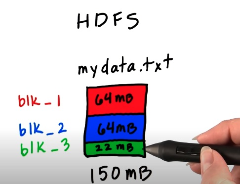
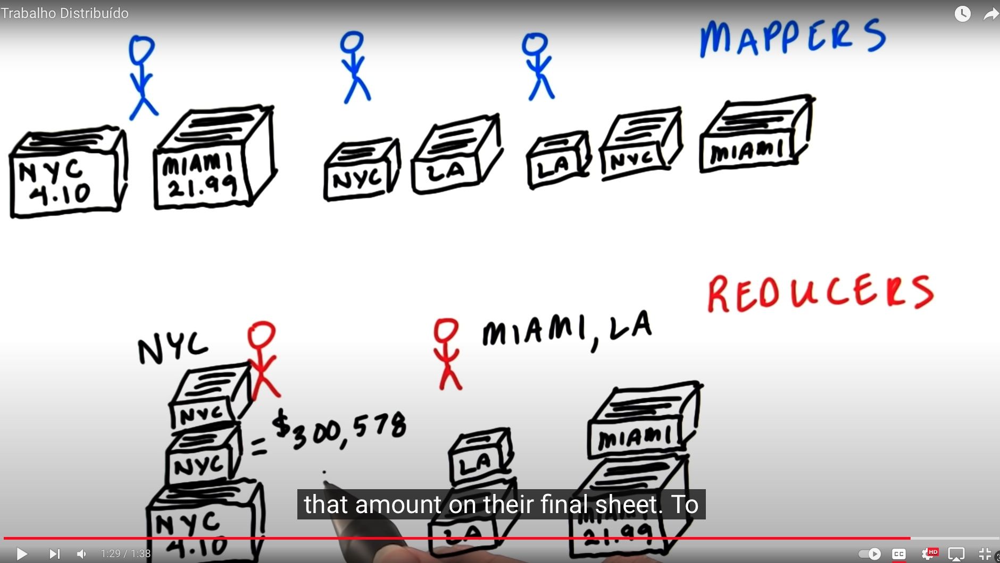
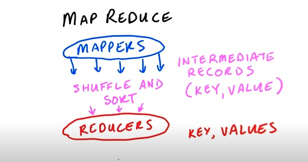
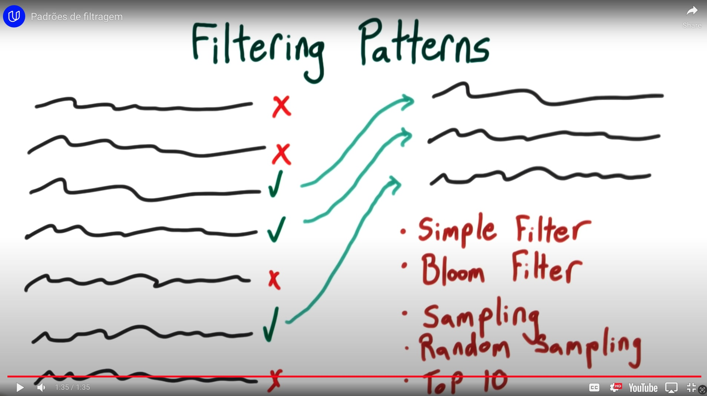

# Introduction to Hadoop and MapReduce

I made these notes while following the Udacity course [Intro to Hadoop and MapReduce](https://www.udacity.com/course/intro-to-hadoop-and-mapreduce--ud617).

Lecture videos, complete list: [Introduction to Hadoop and MapReduce](https://www.youtube.com/watch?v=DEQNknALf_8&list=PLAwxTw4SYaPkXJ6LAV96gH8yxIfGaN3H-).

Mikel Sagardia, 2023.  
No guarantees.

Table of contents:

- [Introduction to Hadoop and MapReduce](#introduction-to-hadoop-and-mapreduce)
  - [1. Big Data](#1-big-data)
    - [Hadoop](#hadoop)
  - [2. HDFS and MapReduce](#2-hdfs-and-mapreduce)
    - [HDFS Demo](#hdfs-demo)
    - [MapReduce](#mapreduce)
    - [Running a Job](#running-a-job)
    - [Application Examples](#application-examples)
  - [3. MapReduce Code Example](#3-mapreduce-code-example)
  - [4. MapReduce Design Patterns](#4-mapreduce-design-patterns)
    - [Overview of Patterns](#overview-of-patterns)
    - [Filtering Patterns](#filtering-patterns)
    - [Summarization Patterns](#summarization-patterns)
      - [Combiners](#combiners)
    - [Structural Patterns](#structural-patterns)


## 1. Big Data

Selected videos:

- [Big Data Intro](https://www.youtube.com/watch?v=Fyxi0qlyTaQ)
- [Three Vs](https://www.youtube.com/watch?v=KJKKFV97ntg&t=9s)
- [Data Formats](https://www.youtube.com/watch?v=EVzqlf369tI)
- [Velocity](https://www.youtube.com/watch?v=nPtRFCRMfhw)
- [Doug Cutting: The Origins of Hadoop](https://www.youtube.com/watch?v=ebgXN7VaIZA)
- [Hadoop Core](https://www.youtube.com/watch?v=alie2Kn-jRY)
- [Hadoop Ecosystem](https://www.youtube.com/watch?v=4sZ7n-Wg9Dc)

Summary points:

- Big data refers to the production of large amounts of data, which is (1) **difficult to store** and (2) **process** with *single servers*.
- Challenges of big data, the 3 Vs:
  - Volume: we have many data and most of seems to be worthless.
  - Velocity: Data is created fast, sometimes streamed; we can get data as fast as TB/day.
  - Variety: We have data from different sources and in various formats; unlike traditional data, it is unstructured and it doesn't fit that easily to relational/SQL databases. The nice thing about Hadoop is that  we can store the data in raw format for later processing. For instance: we can store in MP3 the phone calls to later extract a *mood* indicator from the conversation.
- Typical data candidate for big data:
  - Transactions
  - Logs
  - Business actions
  - User actions
  - Sensor data
  - Medical data
  - Social network data

### Hadoop

- Hadoop originated as an Open Source implementation of Google's work on distributed systems, focusing on [MapReduce](http://static.googleusercontent.com/media/research.google.com/en/us/archive/mapreduce-osdi04.pdf) and [GFS - Google File System](http://static.googleusercontent.com/media/research.google.com/en/us/archive/gfs-sosp2003.pdf). Hadoop was the first open source implementation of an OS for distributed systems.
- Hadoop consists of two main components
    1.  Hadoop Distributed File System: HDFS - to **store** data.
        - Data is split and store in different machines.
        - The machines forma cluster.
        - We can in extend the cluster adding more machines as we require.
        - The machines don't need to be high-end!
    2.  Hadoop MapReduce - to **process** data.
        - The data is processed in each machine separately, locally.
        - Then, the results are aggregated.
- Hadoop Ecosystem: many layers and modules have appeared to make it easier to use Hadoop, instead of forcing the user to write MapReduce code in Java
  - Hive (SQL) and Pig (scripting): they enable the users to interface the data in the cluster using SQL or simple scripting. Their code is translated into MapReduce.
  - Impala: It is similar to Hive, because it enables SQL queries to the data, but it doesn't use MapReduce as an intermediate step, it directly accesses the HDFS. In general:
    - Hive is used for large batch jobs.
    - Imapala is used to fast online queries.
  - Sqoop: transfers SQL database data into the cluster HDFS.
  - Flume: ingests data from external systems and transfers it into the cluster HDFS.
  - ...
- Cloudera is the company which created Hadoop and they have a CDH, Cloudera Distribution Hadoop.

## 2. HDFS and MapReduce

Selected videos:

- [HDFS](https://www.youtube.com/watch?v=vdkx2xasGlM)
- [Data Redundancy](https://www.youtube.com/watch?v=LV1ncV1MO_g)
- [NameNode Standby](https://www.youtube.com/watch?v=E28J0XY9PEMs)
- [HDFS Demo](https://www.youtube.com/watch?v=l0I_2nyPNZM)
- [MapReduce Example](https://www.youtube.com/watch?v=53jdaPf249c)
- [Hash Tables](https://www.youtube.com/watch?v=KCNKb4-t9WA)
- [Distributed Work](https://www.youtube.com/watch?v=LZfCPgQmeRU)
- [MapReduce Summary](https://www.youtube.com/watch?v=trDuPnmO8Y8)
- [Daemons of MapReduce](https://www.youtube.com/watch?v=CyRECFXtVlQ)
- [Running a MapReduce Job](https://www.youtube.com/watch?v=WyEkdh1Qptk)

When we store a file in HDFS, first we split it into blocks of equal size (except the remainder). Then, each node is stored on one node in the cluster, called **DataNodes**. The special node **NameNode** contains the metadata which contains where each block is stored.

Each block is copied 3x and each copy stored in a different *randomly* selected DataNode; that way, if a node fails, we have still two with the block.

Similarly, there is an *active* NameNode and a *standby* NameNode. If the active one fails, the standby one takes its role and no information is lost.



### HDFS Demo

After a Hadoop cluster has been configured, we can upload and access data to/in it by simple commands

```bash
# Local machine
ls # purchases.txt

# Cluster: ls; there is nothing now
hadoop fs -ls

# Upload file to cluster: it is automatically chopped
# and distributed
hadoop fs -put purchases.txt

# Now, we should see purchases.txt
hadoop fs -ls

# Rename
hadoop fs -mv purchases.txt newname.txt

# Remove
hadoop fs -rm newname.txt

# Create a directory
hadoop fs -mkdir myinput

# Upload to directory
hadoop fs -put purchases.txt myinput

# Download to local machine
hadoop fs -get myinput/purchases.txt
```

### MapReduce

MapReduce processes each data chunk in each DataNode in parallel. 

Example: we have all the sales from 2012 stored in a TXT which contains the values `date`, `location`, `amount`. We want to compute the total sales by location. If the file is stored in chunks using HDFS, MapReduce sweeps each chunk in parallel and computes the aggregate values in each chunk.

Hash tables could be used to store the aggregated values, i.e., the *key* is the *location* and the *value* is the *total sales*. However, the work is done with two kinds of processes:

- Mappers: these pile the location information (location + sales) from the chunk; i.e., all *Miami* sale entries are piled together as they're found. The mappers are small parallel processes, each deals with small amounts of data. The piled records are in the form of *key-value* pairs.
- Reducers: they pick the piles and compute the aggregated value. Each reducer can pick several keys (locations), but all the values associated to that key.

When the mappers finish, the collected *intermediate records* are transferred to the *reducers* using a process called **shuffle and sort**.





### Running a Job

```bash
# We see purchases.txt
hadoop fs -ls

# To run MapReduce, we need to write our
# mapper.py and reducer.py code and execute it as follows
hadoop jar /path/to/hadoop/executable.jar -mapper mapper.py -reducer reducer.py -file mapper.py -input myinput -output joboutput
# Usually an alias is created

# That generates the results in joboutput
hadoop fs -ls joboutput
# _SUCCESS
# _logs
# part-00000

# Get the results table to the local disk: part-00000 
hadoop fs -get joboutput/part-00000
```

### Application Examples

- Process logs: How many times has a page been accessed?
- Anything large and that can be processed in parallel.

## 3. MapReduce Code Example

When Hadoop Stream is used, we can use any language to run MapReduce on the Hadoop cluster. However, that requires applying the standard input/output streams (i.e., `print`). In the previous code examples python scripts could be run because the Hadoop Stream executable was run.

In this section, a log file which contains, among others, lines as the following is processed:

```
2013-10-09  13:22   Miami   Boots   99.95   Visa
```

The goal is to obtain the complete sales amount per city/store. The selling log lines are 6 values split with `TAB`; however, note that we can have also other types of log lines. Usually, we would use regex, but in this case we assume that all log lines with 6 tab-separated values are the lines we're looking for.

Lecture video: [Exercise Summary](https://www.youtube.com/watch?v=MYo8EZwDRUA).

The code for the mapper and the reducer would be the following:

`mapper.py`: 

```python
# Your task is to make sure that this mapper code does not fail on corrupt data lines,
# but instead just ignores them and continues working
import sys
import StringIO

def mapper():
    # read standard input line by line
    for line in sys.stdin:
        # strip off extra whitespace, split on tab and put the data in an array
        data = line.strip().split("\t")

        # This is the place you need to do some defensive programming
        # what if there are not exactly 6 fields in that line?
        # YOUR CODE HERE
        if len(data) < 6:
            continue
        
        # this next line is called 'multiple assignment' in Python
        # this is not really necessary, we could access the data
        # with data[2] and data[5], but we do this for conveniency
        # and to make the code easier to read
        date, time, store, item, cost, payment = data
        
        # Now print out the data that will be passed to the reducer
        print("{0}\t{1}".format(store, cost))
        
test_text = """2013-10-09\t13:22\tMiami\tBoots\t99.95\tVisa
2013-10-09\t13:22\tNew York\tDVD\t9.50\tMasterCard
2013-10-09 13:22:59 I/O Error
^d8x28orz28zoijzu1z1zp1OHH3du3ixwcz114<f
1\t2\t3"""

# This function allows you to test the mapper with the provided test string
def main():
	sys.stdin = StringIO.StringIO(test_text)
	mapper()
	sys.stdin = sys.__stdin__
```

`reducer.py`: 

```python

import sys

salesTotal = 0
oldKey = None

for line in sys.stdin:
    data = line.strip().split("\t")
    if len(data) != 2:
        # Something has gone wrong. Skip this line.
        continue

    thisKey, thisSale = data
    if oldKey and oldKey != thisKey:
        print(oldKey, "\t", salesTotal)
        oldKey = thisKey
        salesTotal = 0

    oldKey = thisKey
    salesTotal += float(thisSale)

if oldKey != None:
    print(oldKey, "\t", salesTotal)
```

## 4. MapReduce Design Patterns

In general, problems can be classified into classes of problems; for each class, we can apply boilerplate solutions. These are the so called *design patterns*.

Lecture videos:

- [Overview of Patterns](https://www.youtube.com/watch?v=eSPfyzVrL98)
- [Filtering Patterns](https://www.youtube.com/watch?v=x4zg5mDoZRo)
- [Summarization Patterns](https://www.youtube.com/watch?v=9-ZXELXsyWI)
- [Finding the Mean](https://www.youtube.com/watch?v=KeEkD8KTpJs)
- [Combiners](https://www.youtube.com/watch?v=aCwPIue7k2o)
- [Structural Patterns](https://www.youtube.com/watch?v=uhvwbYresdA)

### Overview of Patterns

There are 3 major pattern types:

- Filtering Patterns
  - Sampling data
  - Generate top-n lists
- Summarization Patterns
  - Counting records
  - Finding statistics: min, max, mean, median, etc.
  - Create an index
- Structural Patterns
  - Combining 2 datasets

The idea is to learn to recognize the patterns; then, at work, we identify them and *look* for a solution in Google using the pattern keyword!

Other types of patterns are:

- Organizational
- Input/Output
- etc.

### Filtering Patterns

They have one thing in common: they don't change the data. A function that filters, goes through all the records (in parallel) and selects records according to the filter we have:

- Simple filter: take record if given condition is satisfied, e.g., sale bigger than 100 USD.
- [Bloom filter](https://en.wikipedia.org/wiki/Bloom_filter): efficient probabilistic filter which returns records which are "possibly in set" or "definitely not in set".
- Sampling: take 1 every 2 records.
- Random sampling.
- Top-n: take top 10 sale records.



### Summarization Patterns

Summarization procedures give a high-level overview of our data; we distinguish two major types:

- Inverted index: like the index of a book, or the index that Google does when crawling the web. In a book, we have key terms at the end and the page numbers where they appear.
- Numerical summarizations: word/record count, min/max, first/last, mean/median, etc.

In numerical summarizations the key is the element we'd like to summarize (e.g., a word, field, etc.) and the value is the summary operation.

Frequently, in those kind of numerical summarizations,

- the mapper collects key-value pairs
- the reducer performs all the math.

Example: we have the logs of all web events, among which are sales. We'd like to know if there is a correlation between the day of the week and the sales. To that end, we need to parse all logs, select sales entries and:

- the mapper creates dictionaries with `day-of-the-week: sales`, i.e., `Moday: 5.20`,
- the reducers collect each of the `day-of-the-week` keys and compute the mean and the standard deviation, among others; e.g., keep sum and count, and then divide.

#### Combiners

Combiners are processes than happen between the mapper and the reducer; specifically, the node where the mapping is carried out also combines the mapped data, i.e., it reduces it somehow, before sending it to the reducer node.

Example that illustrates the motivation of this: in the logs example from before, it might happen that we have 4M entries for the key `Monday` in one mapper node. Transferring all those `Monday` key-value pairs to a reducer node is a lot of network bandwidth. Instead, it makes sense to combine/reduce those entries, if possible. In this case, it is possible: we can sum and count the values and transfer those combined data to the reducer. The effect is: much less network congestion and much faster execution.

### Structural Patterns

We use this pattern when migrating data, e.g., from a relational database (SQL) to Hadoop. Hadoop can work with data in any format, but if we use data in a SQL database, it is already hierarchically structured, so we can speed up the Hadoop ingestion.

To use this pattern

- the data sources must be linked by foreign keys
- the data must be structured and row-based.

