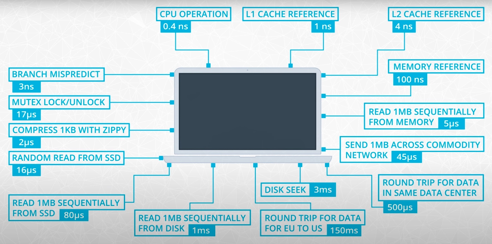

# Spark

I made these notes while following the Udacity course [Spark](https://www.udacity.com/course/learn-spark-at-udacity--ud2002).

Additionally, I extended the  notes with contents from the following courses at the Datacamp track [Big Data with PySpark](https://app.datacamp.com/learn/skill-tracks/big-data-with-pyspark):

- Introduction to PySpark
- Big Data Fundamentals with PySpark
- Cleaning Data with PySpark
- Feature Engineering with PySpark
- Machine Learning with PySpark
- Building Recommendation Engines with PySpark

Mikel Sagardia, 2023.  
No guarantees.

Table of contents:

- [Spark](#spark)
  - [1. Introduction](#1-introduction)
    - [Udacity Project Overview](#udacity-project-overview)
    - [Installation and Setup](#installation-and-setup)
  - [2. The Power of Spark](#2-the-power-of-spark)
    - [Hardware in Numbers](#hardware-in-numbers)
      - [Examples](#examples)
    - [Big Data in Numbers](#big-data-in-numbers)
    - [Hadoop and Spark](#hadoop-and-spark)
    - [MapReduce](#mapreduce)
    - [Spark Modes](#spark-modes)
    - [Spark Use Cases](#spark-use-cases)
  - [3. Data Wrangling with Spark](#3-data-wrangling-with-spark)
  - [4. Setting up Spark Clusters with AWS](#4-setting-up-spark-clusters-with-aws)
  - [5. Debugging and Optimization](#5-debugging-and-optimization)
  - [6. Machine Learning with PySpark](#6-machine-learning-with-pyspark)

## 1. Introduction

This module is an introductory module of Udacity, where the basic course structure is explained, as well as a project.

Section videos:

- [Welcome](https://www.youtube.com/watch?v=D7vrej8uLzs&t=28s)
- [Instructors](https://www.youtube.com/watch?v=1h6ToHj7mcM)
- [Course Overview](https://www.youtube.com/watch?v=P7YAisWITAs)
- [Project Overview](https://www.youtube.com/watch?v=lPCzCEG2yRs)

### Udacity Project Overview

Video: [Project Overview](https://www.youtube.com/watch?v=lPCzCEG2yRs)

I made a dedicated repository for the Udacity final project: [sparkify_customer_churn](https://github.com/mxagar/sparkify_customer_churn). I have non-committed link to that repository in the folder [`lab`](./lab/); additionally, all coding examples from this module are collected in that folder [`lab`](./lab/).

Key ideas of the project:

- Music streaming service, similar to Spotify: Users can listen to streamed music.
- We have: (1) free-tier, (2) subscription plan.
- Every time an user is involved in an event, it is logged with a timestamp; example events: songplay, logout, like, ad_heard, downgrade, etc.
- Goal: predict churn, either (1) as downgrade from premium to free or (2) as leaving the service.
- With churn predictions, the company can target those users with incentives: discounts, etc.

### Installation and Setup

:construction:

## 2. The Power of Spark

Module videos:

- [Introduction to Spark](https://www.youtube.com/watch?v=RWtS_ErlmXE)
- [What Qualifies As Big Data](https://www.youtube.com/watch?v=tGHCCvKKpuo)
- [Numbers Everyone Should Know](https://www.youtube.com/watch?v=XGQT-uzt4v8)
- [Numbers Everyone Should Know: CPU](https://www.youtube.com/watch?v=LNv-urROvr0)
- [Numbers Everyone Should Know: Memory](https://www.youtube.com/watch?v=Wvz1UeYkjsw)
- [Memory Efficiency](https://www.youtube.com/watch?v=Gx0_7CUFInM)
- [Numbers Everyone Should Know: Storage](https://www.youtube.com/watch?v=3nL6JM3QbQQ)
- [Numbers Everyone Should Know: Network](https://www.youtube.com/watch?v=MP9fIYT5Vvg)
- [Hardware: Key Ratios](https://www.youtube.com/watch?v=VPVGYKQcG7Q)
- [Big Data Numbers Part 1](https://www.youtube.com/watch?v=314zCU4O-f4)
- [Big Data Numbers Part 2](https://www.youtube.com/watch?v=QjPr7qeJTQk)
- [Medium Data Numbers](https://www.youtube.com/watch?v=5E0VLIhch6I)
- [History Of Parallel Computing Distributed Systems](https://www.youtube.com/watch?v=9CRZURNg2zs)
- [The Hadoop Ecosystem And New Technologies For Data Processing](https://www.youtube.com/watch?v=0CgMtPYwLR8)
- [MapReduce](https://www.youtube.com/watch?v=ErgNIy7z4SE)
- [Spark Cluster Configuration](https://www.youtube.com/watch?v=DpPD5hhvspg)

### Hardware in Numbers

The numbers everyone should know (Peter Norveig, Google): We should learn at least the following hardware-related speed numbers and concepts:

- **CPU** operation: 0.4 ns
  - Mutex lock/unlock: 17 ns
  - Registers store small pieces of data that the CPU is crunching at the moment.
  - However, the CPU sits idle most of the time, because the bottleneck is the data access from the memory.
- **Memory** (RAM) reference: 100 ns
  - Read 1 MB sequentially in memory: 3 microsec.
  - Getting data from memory is 250x slower than the CPU! We need the memory to pass the data to the CPU, since the registers contain only small amounts of data, which is being crunched at the moment.
  - Data arrangement in memory is important: is all data is sequential, loading it to the CPU is much faster!
  - Memory is ephemeral (it does not persist) and expensive.
  - Google was a pioneer at preferring distributed systems built with commodity hardware instead of large and expensive memory-equipped systems; today, Google's model is an industry standard.
- **Storage**: Random read from SSD: 16 microsec.
  - Read 1 MB sequentially in memory: 49 microsec.
  - On average, SSDs are 15x slower than memory.
  - Spark is designed to avoid using disk; instead, it uses memory.
- **Network**: Round trip data from EU to US: 150 millisec.
  - Send 2 KB in local commodity network: 44 ns
  - It is currently the bottleneck in moving data.
  - Spark needs to move data around, because it uses distributed systems.

**Summary of key ratios:**

- **CPU is 200x faster than memory**
- **Memory is 15x faster than SSD**
- **SSD is 20x faster than Network**

#### Examples

> A 2.5 Gigahertz CPU means that the CPU processes 2.5 billion operations per second. Let's say that for each operation, the CPU processes 8 bytes of data. How many bytes could this CPU process per second? 
>
> **Answer**: 2.5 10^9 * 8 byte / sec = 20 10^9 byte / sec. However, not all that data can be loaded instantaneously from memory!

> Twitter generates about 6,000 tweets per second, and each tweet contains 200 bytes. So in one day, Twitter generates data on the order of:
>
> (6000 tweets / second) x (86400 seconds / day) x (200 bytes / tweet) = 104 billion bytes / day
>
> Knowing that tweets create approximately 104 billion bytes of data per day, how long would it take the 2.5 GigaHertz CPU to analyze a full day of tweets?
>
> **Answer**: 104 / 20 = 5.2 sec. However, not all that data can be loaded instantaneously from memory!

Links:

- [Peter Norveig: Teach Yourself Programming in Ten Years](http://norvig.com/21-days.html)
- [Interactive: Latency Numbers Every Programmer Should Know](https://colin-scott.github.io/personal_website/research/interactive_latency.html)

### Big Data in Numbers

Characteristics of Big Data:

- Data stored in several machines, distributed.
- High volume of data.
- High speed of data, velocity.
- High variety of data.

If we have a dataset of 4 GB and a computer memory of 8 GB, the problem is **not a big data** problem, because the data fits in memory.

If we have a dataset which does not fit in memory by large, e.g., of a size of 200 GB, then, we do have a **big data** problem. Those sizes easily appear in logs of web services that have a considerable user base, e.g., in the music streaming project introduced before.

When we have a dataset of 200 GB, a single computer will start processing it but collapse:

- First 8 GB are loaded to memory, then CPU, and processed by CPU
- Processed data (e.g., 15 MB) is returned to memory, then, SSD
- Next 8 GB are fetched and loaded.
- The CPU is switching the context very often, not really processing the data most of the time; that context-switching is called *thrashing* and causes the process to collapse.

Also, note that Pandas has a functionality to read a dataset in chunks: [Iterating through files chunk by chunk](https://pandas.pydata.org/pandas-docs/stable/user_guide/io.html#io-chunking). In cases where the dataset slightly exceeds the size of the memory, it might make sense to use that functionality to process the dataset in chunks.

### Hadoop and Spark

Probably, the boom of Big Data started with the release of Hadoop, which was implemented after the publication of the MapReduce paper by Jeff Dean.

See the other module on Hadoop: [`01_Intro_Hadoop`](../01_Intro_Hadoop).

Hadoop is older than Spark; Spark uses the concepts introduced in Hadoop. Most important elements of Hadoop:

- Hadoop Distributed File System, HDFS: storage, distributed.
- Hadoop MapReduce: processing in parallel/distributed systems.
- Hadoop YARN: resource management.

Other tools:

- Apache Pig: SQL-like language running on top of Hadoop MapReduce.
- Apache Hive: also an SQL-like interface.

Spark vs. Hadoop:

- Spark is an a newer and equivalent framework to Hadoop.
- Spark is faster than Hadoop; this is mainly because Spark works with data in memory, avoiding to write them to disk (as done by Hadoop).
- Spark does not have a file system: we can use HDFS if we want, or Amazon S3, for instance.
- Spark comes with ML, SQL and Streaming libraries (although Flink and Storm are faster), among others.

### MapReduce

MapReduce is a way of processing data in parallel; for instance, we have a large dataset of logs related to the events in the music streaming service. We want to know the ranking of most listened songs. The MapReduce process works as follows:

- The data is stored in a distributed manner (in chunks) in commodity nodes. We know where each chunk is, and there is also redundancy.
- To create a ranking, we need to count the reproduction of each song.
- In each node with a chunk, we iterate through all lines and create tuples or key-value pairs which contain the song name and a counter of play, i.e., `1`: `(Let it be, 1)`. That process is **map**.
- Then, all tuples are **shuffled**, i.e., all pairs with the same key are packed together.
- Finally, all stacked pairs are aggregated: we count the number of pairs for each key.

Example: [`lab/01_map_reduce/`](./lab/01_map_reduce/).

### Spark Modes

Spark can work in two major modes:

- Local-mode: we install Spark on our computer and do everything there.
- Cluster-mode: we create a cluster of nodes and leverage the distributed computing capabilities for big data.

Obviously, we want to use the cluster-mode; the local-mode is used to learn and test our implementations.

Additionally, we have:

- A **master node**, which has the **driver program**, and within it sits the **SparkContext**. We always have and interact with the Spark context.
- The Spark context talks to the **cluster manager**, which is outside from the **master node**. That manager can be, for instance Yarn and it takes care of the resource distribution.
- The **cluster manager** handles the **worker nodes**, which are independent from the manager and are usually distributed. It requests containers with certain capacities within them depending on the workload.

In the cluster-mode, we can have several cluster managers:

- Stand-alone, i.e., Spark itself.
- Apache Mesos.
- Hadoop Yarn.
- Kubernetes.

### Spark Use Cases

Typical usage with large, distributed datasets:

- [Data analytics](https://spark.apache.org/sql/)
- [Machine learning](https://spark.apache.org/mllib/)
- [Streaming](https://spark.apache.org/streaming/)
- [Graph analytics](https://spark.apache.org/graphx/)

Limitations of Spark:

- Streaming has a latency of 500 ms; faster alternatives are: [Apache Storm](https://storm.apache.org), [Apex](https://apex.apache.org), [Flink](https://flink.apache.org).
- Deep learning is not available, but there are projects which integrate, e.g., Spark with Tensorflow.
- Machine learning algorithms that scale linearly with data are possible only.

## 3. Data Wrangling with Spark

## 4. Setting up Spark Clusters with AWS

## 5. Debugging and Optimization

## 6. Machine Learning with PySpark