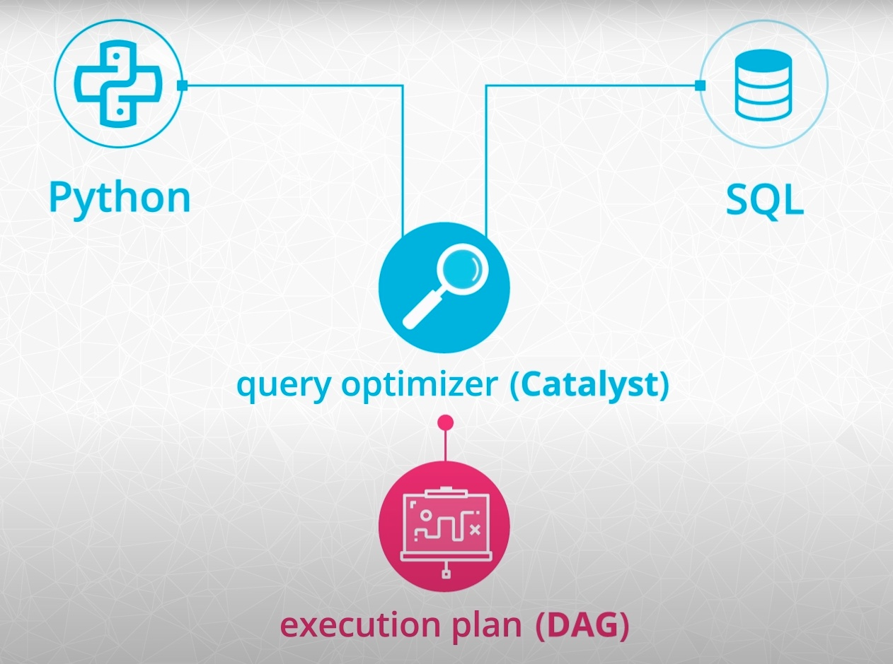

# Spark

I made these notes while following the Udacity course [Spark](https://www.udacity.com/course/learn-spark-at-udacity--ud2002).

Additionally, I extended the  notes with contents from the following courses at the Datacamp track [Big Data with PySpark](https://app.datacamp.com/learn/skill-tracks/big-data-with-pyspark):

- Introduction to PySpark
- Big Data Fundamentals with PySpark
- Cleaning Data with PySpark
- Feature Engineering with PySpark
- Machine Learning with PySpark
- Building Recommendation Engines with PySpark

Mikel Sagardia, 2023.  
No guarantees.

Table of contents:

- [Spark](#spark)
  - [1. Introduction](#1-introduction)
    - [Udacity Project Overview](#udacity-project-overview)
    - [Installation and Setup](#installation-and-setup)
  - [2. The Power of Spark](#2-the-power-of-spark)
    - [Hardware in Numbers](#hardware-in-numbers)
      - [Examples](#examples)
    - [Big Data in Numbers](#big-data-in-numbers)
    - [Hadoop and Spark](#hadoop-and-spark)
    - [MapReduce](#mapreduce)
    - [Spark Modes](#spark-modes)
    - [Spark Use Cases](#spark-use-cases)
  - [3. Introduction to PySpark](#3-introduction-to-pyspark)
    - [3.1 Basics: Getting to know PySpark](#31-basics-getting-to-know-pyspark)
      - [3.1.1 Setup](#311-setup)
        - [Install PySpark](#install-pyspark)
        - [Run PySpark](#run-pyspark)
        - [Running on a Notebook](#running-on-a-notebook)
        - [Spark UI](#spark-ui)
      - [3.1.2 Creating a Spark Session](#312-creating-a-spark-session)
      - [3.1.3 Spark SQL Dataframes: Uploading and Consulting](#313-spark-sql-dataframes-uploading-and-consulting)
      - [3.1.4 Common Methods and Attributes of the SQL Dataframe](#314-common-methods-and-attributes-of-the-sql-dataframe)
      - [3.1.5 SQL Queries](#315-sql-queries)
      - [3.1.6 Pandafying: Convert a Spark SQL Dataframe into a Pandas Dataframe](#316-pandafying-convert-a-spark-sql-dataframe-into-a-pandas-dataframe)
      - [3.1.7 Sparkifying: Convert a Pandas Dataframe into a Spark SQL Dataframe](#317-sparkifying-convert-a-pandas-dataframe-into-a-spark-sql-dataframe)
    - [3.2 Manipulating Data](#32-manipulating-data)
      - [Setup: Create Session + Upload Data](#setup-create-session--upload-data)
      - [3.2.1 Creating, Renaming, and Casting Columns](#321-creating-renaming-and-casting-columns)
      - [3.2.2 SQL in a Nutshell](#322-sql-in-a-nutshell)
      - [3.2.3 Filtering Data: WHERE - filter()](#323-filtering-data-where---filter)
      - [3.2.4 Selecting Columns: SELECT - select(), selectExpr(), alias()](#324-selecting-columns-select---select-selectexpr-alias)
      - [3.2.5 Grouping and Aggregating: GROUP BY, MIN, MAX, COUNT, SUM, AVG, AGG](#325-grouping-and-aggregating-group-by-min-max-count-sum-avg-agg)
        - [Aggregation Functions](#aggregation-functions)
      - [3.2..6 Joining: JOIN - join()](#326-joining-join---join)
    - [3.3 Introduction to Machine Learning Pipelines](#33-introduction-to-machine-learning-pipelines)
      - [Setup: Create Session + Upload Data](#setup-create-session--upload-data-1)
      - [3.3.1 Introduction to Machine Learning in Spark](#331-introduction-to-machine-learning-in-spark)
      - [3.3.2 Data Processing Pipeline](#332-data-processing-pipeline)
        - [Join](#join)
        - [Cast Types](#cast-types)
        - [New Features/Columns](#new-featurescolumns)
        - [Remove Missing Values](#remove-missing-values)
        - [Encode Categoricals](#encode-categoricals)
        - [Assemble a Vector and Create a Pipeline](#assemble-a-vector-and-create-a-pipeline)
        - [Fit and Transform the Pipeline](#fit-and-transform-the-pipeline)
        - [Train/Test Split](#traintest-split)
      - [3.3.3 Model Tuning and Selection](#333-model-tuning-and-selection)
        - [Instantiate Logistic Regression Model](#instantiate-logistic-regression-model)
        - [Instantiate Evaluation Metric](#instantiate-evaluation-metric)
        - [Instantiate Parameter Grid](#instantiate-parameter-grid)
        - [Cross Validation Object](#cross-validation-object)
        - [Fit the Model with Grid Search](#fit-the-model-with-grid-search)
        - [Evaluate the Model](#evaluate-the-model)
  - [4. Data Wrangling with Spark](#4-data-wrangling-with-spark)
      - [Lecture Videos](#lecture-videos)
    - [4.1 Functional Programming](#41-functional-programming)
      - [Pure Functions and Direct Acyclic Graphs (DAGs)](#pure-functions-and-direct-acyclic-graphs-dags)
      - [Example Notebook: Functional Programming](#example-notebook-functional-programming)
    - [4.2 Loading Data to Spark: Read and Write](#42-loading-data-to-spark-read-and-write)
      - [SparkContext and SparkSession](#sparkcontext-and-sparksession)
      - [Example Notebook: Read and Write Data into Spark Dataframes](#example-notebook-read-and-write-data-into-spark-dataframes)
    - [4.3 Data Wrangling with Python: Spark Dataframe](#43-data-wrangling-with-python-spark-dataframe)
      - [Extra Tips](#extra-tips)
      - [Quiz / Exercise](#quiz--exercise)
    - [4.4 Data Wrangling with SQL: Spark SQL](#44-data-wrangling-with-sql-spark-sql)
      - [Quiz / Exercise](#quiz--exercise-1)
  - [5. Setting up Spark Clusters with AWS](#5-setting-up-spark-clusters-with-aws)
    - [5.1 Introduction](#51-introduction)
    - [5.2 \[OLD - Not working\] Set Up AWS](#52-old---not-working-set-up-aws)
      - [Create an AWS EMR Cluster Using the Web Interface](#create-an-aws-emr-cluster-using-the-web-interface)
      - [AWS CLI](#aws-cli)
        - [Step 1: Install AWS CLI](#step-1-install-aws-cli)
        - [Step 2: Create an AWS IAM to use it with the CLI](#step-2-create-an-aws-iam-to-use-it-with-the-cli)
        - [Step 3: Configure the AWS CLI](#step-3-configure-the-aws-cli)
      - [Re-/Create an AWS EMR Cluster Using the AWS CLI](#re-create-an-aws-emr-cluster-using-the-aws-cli)
      - [Connection to the EMR Cluster via SSH](#connection-to-the-emr-cluster-via-ssh)
      - [Launch a Jupyter Notebook on EMR and Connect to It from Local Browser](#launch-a-jupyter-notebook-on-emr-and-connect-to-it-from-local-browser)
    - [5.2 \[NEW - Alternative\] Set Up Docker Cluster](#52-new---alternative-set-up-docker-cluster)
    - [5.3 Submitting Python Scripts to the AWS Cluster](#53-submitting-python-scripts-to-the-aws-cluster)
  - [6. Debugging and Optimization](#6-debugging-and-optimization)
  - [7. Machine Learning with PySpark](#7-machine-learning-with-pyspark)


## 1. Introduction

This module is an introductory module of Udacity, where the basic course structure is explained, as well as a project.

Section videos:

- [Welcome](https://www.youtube.com/watch?v=D7vrej8uLzs&t=28s)
- [Instructors](https://www.youtube.com/watch?v=1h6ToHj7mcM)
- [Course Overview](https://www.youtube.com/watch?v=P7YAisWITAs)
- [Project Overview](https://www.youtube.com/watch?v=lPCzCEG2yRs)

### Udacity Project Overview

Video: [Project Overview](https://www.youtube.com/watch?v=lPCzCEG2yRs)

I made a dedicated repository for the Udacity final project: [sparkify_customer_churn](https://github.com/mxagar/sparkify_customer_churn).

All coding examples from this module are collected in that folder [`lab`](./lab/).

Key ideas of the project:

- Music streaming service, similar to Spotify: Users can listen to streamed music.
- We have: (1) free-tier, (2) subscription plan.
- Every time an user is involved in an event, it is logged with a timestamp; example events: songplay, logout, like, ad_heard, downgrade, etc.
- Goal: predict churn, either (1) as downgrade from premium to free or (2) as leaving the service.
- With churn predictions, the company can target those users with incentives: discounts, etc.

### Installation and Setup

There are two major modes to run Spark:

- Locally
- In a cluster

To leverage the power of distributed system for big data, we need to use the cluster-mode; however, by running Spark on our desktop computer (i.e., locally on one machine) helps test an learn the framework.

- To see how to install and use PySpark locally, check Section [3. Introduction to PySpark](#3-introduction-to-pyspark).
- To set a Spark cluster on AWS, check Section [5. Setting up Spark Clusters with AWS](#5-setting-up-spark-clusters-with-aws).

## 2. The Power of Spark

Module videos:

- [Introduction to Spark](https://www.youtube.com/watch?v=RWtS_ErlmXE)
- [What Qualifies As Big Data](https://www.youtube.com/watch?v=tGHCCvKKpuo)
- [Numbers Everyone Should Know](https://www.youtube.com/watch?v=XGQT-uzt4v8)
- [Numbers Everyone Should Know: CPU](https://www.youtube.com/watch?v=LNv-urROvr0)
- [Numbers Everyone Should Know: Memory](https://www.youtube.com/watch?v=Wvz1UeYkjsw)
- [Memory Efficiency](https://www.youtube.com/watch?v=Gx0_7CUFInM)
- [Numbers Everyone Should Know: Storage](https://www.youtube.com/watch?v=3nL6JM3QbQQ)
- [Numbers Everyone Should Know: Network](https://www.youtube.com/watch?v=MP9fIYT5Vvg)
- [Hardware: Key Ratios](https://www.youtube.com/watch?v=VPVGYKQcG7Q)
- [Big Data Numbers Part 1](https://www.youtube.com/watch?v=314zCU4O-f4)
- [Big Data Numbers Part 2](https://www.youtube.com/watch?v=QjPr7qeJTQk)
- [Medium Data Numbers](https://www.youtube.com/watch?v=5E0VLIhch6I)
- [History Of Parallel Computing Distributed Systems](https://www.youtube.com/watch?v=9CRZURNg2zs)
- [The Hadoop Ecosystem And New Technologies For Data Processing](https://www.youtube.com/watch?v=0CgMtPYwLR8)
- [MapReduce](https://www.youtube.com/watch?v=ErgNIy7z4SE)
- [Spark Cluster Configuration](https://www.youtube.com/watch?v=DpPD5hhvspg)

### Hardware in Numbers

The numbers everyone should know (Peter Norveig, Google): We should learn at least the following hardware-related speed numbers and concepts:

- **CPU** operation: 0.4 ns
  - Mutex lock/unlock: 17 ns
  - Registers store small pieces of data that the CPU is crunching at the moment.
  - However, the CPU sits idle most of the time, because the bottleneck is the data access from the memory.
- **Memory** (RAM) reference: 100 ns
  - Read 1 MB sequentially in memory: 3 microsec.
  - Getting data from memory is 250x slower than the CPU! We need the memory to pass the data to the CPU, since the registers contain only small amounts of data, which is being crunched at the moment.
  - Data arrangement in memory is important: is all data is sequential, loading it to the CPU is much faster!
  - Memory is ephemeral (it does not persist) and expensive.
  - Google was a pioneer at preferring distributed systems built with commodity hardware instead of large and expensive memory-equipped systems; today, Google's model is an industry standard.
- **Storage**: Random read from SSD: 16 microsec.
  - Read 1 MB sequentially in memory: 49 microsec.
  - On average, SSDs are 15x slower than memory.
  - Spark is designed to avoid using disk; instead, it uses memory.
- **Network**: Round trip data from EU to US: 150 millisec.
  - Send 2 KB in local commodity network: 44 ns
  - It is currently the bottleneck in moving data.
  - Spark needs to move data around, because it uses distributed systems.


**Summary of key ratios:**

- **CPU is 200x faster than memory**
- **Memory is 15x faster than SSD**
- **SSD is 20x faster than Network**

#### Examples

> A 2.5 Gigahertz CPU means that the CPU processes 2.5 billion operations per second. Let's say that for each operation, the CPU processes 8 bytes of data. How many bytes could this CPU process per second? 
>
> **Answer**: 2.5 10^9 * 8 byte / sec = 20 10^9 byte / sec. However, not all that data can be loaded instantaneously from memory!

> Twitter generates about 6,000 tweets per second, and each tweet contains 200 bytes. So in one day, Twitter generates data on the order of:
>
> (6000 tweets / second) x (86400 seconds / day) x (200 bytes / tweet) = 104 billion bytes / day
>
> Knowing that tweets create approximately 104 billion bytes of data per day, how long would it take the 2.5 GigaHertz CPU to analyze a full day of tweets?
>
> **Answer**: 104 / 20 = 5.2 sec. However, not all that data can be loaded instantaneously from memory!

Links:

- [Peter Norveig: Teach Yourself Programming in Ten Years](http://norvig.com/21-days.html)
- [Interactive: Latency Numbers Every Programmer Should Know](https://colin-scott.github.io/personal_website/research/interactive_latency.html)

### Big Data in Numbers

Characteristics of Big Data:

- Data stored in several machines, distributed.
- High volume of data.
- High speed of data, velocity.
- High variety of data.

If we have a dataset of 4 GB and a computer memory of 8 GB, the problem is **not a big data** problem, because the data fits in memory.

If we have a dataset which does not fit in memory by large, e.g., of a size of 200 GB, then, we do have a **big data** problem. Those sizes easily appear in logs of web services that have a considerable user base, e.g., in the music streaming project introduced before.

When we have a dataset of 200 GB, a single computer will start processing it but collapse:

- First 8 GB are loaded to memory, then CPU, and processed by CPU
- Processed data (e.g., 15 MB) is returned to memory, then, SSD
- Next 8 GB are fetched and loaded.
- The CPU is switching the context very often, not really processing the data most of the time; that context-switching is called *thrashing* and causes the process to collapse.

Also, note that Pandas has a functionality to read a dataset in chunks: [Iterating through files chunk by chunk](https://pandas.pydata.org/pandas-docs/stable/user_guide/io.html#io-chunking). In cases where the dataset slightly exceeds the size of the memory, it might make sense to use that functionality to process the dataset in chunks.

### Hadoop and Spark

Probably, the boom of Big Data started with the release of Hadoop, which was implemented after the publication of the MapReduce paper by Jeff Dean.

See the other module on Hadoop: [`01_Intro_Hadoop`](../01_Intro_Hadoop).

Hadoop is older than Spark; Spark uses the concepts introduced in Hadoop. Most important elements of Hadoop:

- Hadoop Distributed File System, HDFS: storage, distributed.
- Hadoop MapReduce: processing in parallel/distributed systems.
- Hadoop YARN: resource management.

Other tools:

- Apache Pig: SQL-like language running on top of Hadoop MapReduce.
- Apache Hive: also an SQL-like interface.

Spark vs. Hadoop:

- Spark is an a newer and equivalent framework to Hadoop.
- Spark is faster than Hadoop; this is mainly because Spark works with data in memory, avoiding to write them to disk (as done by Hadoop).
- Spark does not have a file system: we can use HDFS if we want, or Amazon S3, for instance.
- Spark comes with ML, SQL and Streaming libraries (although Flink and Storm are faster), among others.

### MapReduce

MapReduce is a way of processing data in parallel; for instance, we have a large dataset of logs related to the events in the music streaming service. We want to know the ranking of most listened songs. The MapReduce process works as follows:

- The data is stored in a distributed manner (in chunks) in commodity nodes. We know where each chunk is, and there is also redundancy.
- To create a ranking, we need to count the reproduction of each song.
- In each node with a chunk, we iterate through all lines and create tuples or key-value pairs which contain the song name and a counter of play, i.e., `1`: `(Let it be, 1)`. That process is **map**.
- Then, all tuples are **shuffled**, i.e., all pairs with the same key are packed together.
- Finally, all stacked pairs are aggregated: we count the number of pairs for each key.

Example: [`lab/01_map_reduce/`](./lab/01_map_reduce/).


### Spark Modes

Spark can work in two major modes:

- Local-mode: we install Spark on our computer and do everything there.
- Cluster-mode: we create a cluster of nodes and leverage the distributed computing capabilities for big data.

Obviously, we want to use the cluster-mode; the local-mode is used to learn and test our implementations.

Additionally, we have:

- A **master node**, which has the **driver program**, and within the **SparkContext** sits . We always have and interact with the Spark context.
- The Spark context talks to the **cluster manager**, which is outside from the **master node**. That manager can be, for instance Yarn and it takes care of the resource distribution.
- The **cluster manager** handles the **worker nodes**, which are independent from the manager and are usually distributed. It requests containers with certain capacities within them depending on the workload.

The `SparkContext` is the main entry point or interaction object in Spark. However, since version 2.0, the `SparkSession` was introduced, which is a higher level API that serves also as an entry point. More on that in the section [SparkContext and SparkSession](#sparkcontext-and-sparksession).

In the cluster-mode, we can have several cluster managers:

- Stand-alone, i.e., Spark itself.
- Apache Mesos.
- Hadoop Yarn.
- Kubernetes.


### Spark Use Cases

Typical usage with large, distributed datasets:

- [Data analytics](https://spark.apache.org/sql/)
- [Machine learning](https://spark.apache.org/mllib/)
- [Streaming](https://spark.apache.org/streaming/)
- [Graph analytics](https://spark.apache.org/graphx/)

Limitations of Spark:

- Streaming has a latency of 500 ms; faster alternatives are: [Apache Storm](https://storm.apache.org), [Apex](https://apex.apache.org), [Flink](https://flink.apache.org).
- Deep learning is not available, but there are projects which integrate, e.g., Spark with Tensorflow.
- Machine learning algorithms that scale linearly with data are possible only.

## 3. Introduction to PySpark

This section is based on the Datacamp course [Introduction to PySpark](https://app.datacamp.com/learn/courses/introduction-to-pyspark). The course has the following chapters:

1. Basics: Getting to know PySpark
2. Manipulating data
3. Getting started with machine learning pipelines
4. Model tuning and selection

The code and notebooks of this section are in [`lab/02_Intro_PySpark`](./lab/02_Intro_PySpark).

### 3.1 Basics: Getting to know PySpark

This entire section is contained in one single notebook and objects in one subsection might be defined in subsections prior to it.

The notebook: [`01_Basics.ipynb`](./lab/02_Intro_PySpark/01_Basics.ipynb).

#### 3.1.1 Setup

##### Install PySpark

If you already have a Python environment with the usual ML libraries and you'd like to add PySpark:

```bash
# Install PySpark manually
python -m pip install pyspark
python -m pip install findspark
```

Alternatively, if you want to create a new Python environment (recommended), you can do it with [conda](https://conda.io/projects/conda/en/latest/user-guide/install/index.html):

```bash
# Set proxy, if required

# Create an environment
conda env create -f conda.yaml
conda activate spark

# Generate pinned requirements.txt
# PySpark is listed there
pip-compile requirements.in

# Install pinned requirements
pip-sync requirements.txt
# ... or
python -m pip install -r requirements.txt

# If required, add new dependencies to requirements.in and sync
# i.e., update environment
pip-compile requirements.in
pip-sync requirements.txt
# ... or
python -m pip install -r requirements.txt

# To delete the conda environment, if required
conda remove --name spark --all
```

If we are using Windows and run the cluster locally, there is an issue with the Hadoop's file system libraries, which need to be installed separately.

To resolve this issue, you need to:

1. **Download WinUtils**: Spark on Windows requires `WinUtils.exe`, which is part of Hadoop binaries but not included with Spark. You can download pre-compiled WinUtils binaries compatible with your Hadoop version from various GitHub repositories:
   
   - [cdarlint/winutils](https://github.com/cdarlint/winutils)
   - [steveloughran/winutils](https://github.com/steveloughran/winutils)
   - or by searching for "Hadoop WinUtils" online.

2. **Set up `HADOOP_HOME`**:
    - Clone the selected repository, e.g., to `C:\...\git_repositories\winutils`
      - We choose the version we're going to use, e.g. `hadoop-3.3.5`
      - We check that in the `<version>\bin` folder, there is a `winutils.exe` file
    - Set `HADOOP_HOME` to the parent directory of `bin`, e.g.: `C:\...\git_repositories\winutils\hadoop-3.3.5`
      - System Properties -> Advanced -> Environment Variables -> System Variables -> New.
    - Add `%HADOOP_HOME%\bin` to your system's `Path` environment variable so that the WinUtils binaries are accessible from anywhere.

3. **Install Java and setup `JAVA_HOME`**:
    - Download: [https://adoptium.net/download/](https://adoptium.net/download/); :warning: you need  the JDK, not the JRE!
    - Set the `JAVA_HOME` variable to point to the `java.exe` binary, e.g., `C:\Program Files\Eclipse Adoptium\jdk-21.0.6.7-hotspot`.
    - Add `%JAVA_HOME%\bin` to your system's `Path` environment variable.

4. **If you are still getting problems, add these environment variables**:
    ```bash
    PYSPARK_PYTHON="C:\Users\...\AppData\Local\anaconda3\envs\spark\python.exe"
    PYSPARK_DRIVER_PYTHON="C:\Users\...\AppData\Local\anaconda3\envs\spark\python.exe"
    SPARK_HOME="C:\Users\...\AppData\Local\anaconda3\envs\spark\Lib\site-packages\pyspark"
    # Path += %SPARK_HOME%\bin
    ```

##### Run PySpark

We can launch a Spark session in the Terminal locally as follows:

```bash
conda activate spark
pyspark
# SparkContext available as 'sc'
# Web UI at: http://localhost:4040/
# SparkSession available as 'spark'

sc # <SparkContext master=local[*] appName=PySparkShell>
sc.version # '3.4.0'

# Now, we execute the scripts we want, which are using the sc SparkContext

```

An example script can be:

```python
import random
num_samples = 100000000
def inside(p):
    x, y = random.random(), random.random()
    return x*x + y*y < 1

# Note that sc is not imported, but it's already available
# This will execute the function inside() with spark
# It might take some time if run locally, because Spark is optimized
# for large and distributed datasets
count = sc.parallelize(range(0, num_samples)).filter(inside).count()
pi = 4 * count / num_samples

print(pi)
sc.stop()
```

##### Running on a Notebook

If we want to use PySpark on a Jupyter notebook, we need to change the environment variables in `~/.bashrc` or `~/.zshrc`:

```bash
export PYSPARK_DRIVER_PYTHON=jupyter
export PYSPARK_DRIVER_PYTHON_OPTS='notebook'
```

Then, we restart `pyspark` and launch jupyter from it:

```bash
conda activate spark
pyspark
jupyter
```

**Alternatively**, we can use `findspark` without modifying the environment variables and without starting pyspark from outside:

```bash
conda activate spark
jupyter lab
```

Then, the notebook could contain the code as follows:

```python
import findspark
findspark.init()

import pyspark
import random

sc = pyspark.SparkContext(appName="Pi") # AppName: Pi
num_samples = 100000000

def inside(p):     
    x, y = random.random(), random.random()
    return x*x + y*y < 1

# This will execute the function inside() with spark
# It might take some time if run locally, because Spark is optimized
# for large and distributed datasets
count = sc.parallelize(range(0, num_samples)).filter(inside).count()
pi = 4 * count / num_samples

print(pi) # 3.14185392
sc.stop()
```

:warning: **I had issues while running the notebook on VSCode so I had to switch to the browser!** I think this can be solved, though.

##### Spark UI

When we start a Spark context/session, a Spark web UI is started at [http://localhost:4040/](http://localhost:4040/); if the port is taken, the next is used, e.g., `4041, 4042, ...`

#### 3.1.2 Creating a Spark Session

The `SparkContext` is the main entry point or interaction object in Spark. However, since version 2.0, the `SparkSession` was introduced, which is a higher level API that serves also as an entry point.

Creating multiple `SparkSession`s and `SparkContext`s can cause issues, use the `SparkSession.builder.getOrCreate()` method instead, which returns an existing `SparkSession` if there's already one in the environment, or creates a new one if necessary. Usually, in a notebook, we run first

```python
import findspark
findspark.init()
```

And then, we create a session and work with it:

```python
# Import SparkSession from pyspark.sql
from pyspark.sql import SparkSession

# Create or get a (new) SparkSession: session
session = SparkSession.builder.getOrCreate()

# Print session: our SparkSession
print(session) # <pyspark.sql.session.SparkSession object at 0x7f8128abd210>
```

If we shut down the notebook/kernel, the session disappears.

#### 3.1.3 Spark SQL Dataframes: Uploading and Consulting

One of the advantages of Spark is that we can consult the data one the cluster with SQL-like queries. To that end, first we need to upload the data and check that it's accessible. Here, a CSV file is uploaded to Spark and registered as a temporary table view in the `session`. The resulting object we get in the Python environment is a Spark SQL dataframe. In later sections, instead of directly reading from CSV files, Pandas dataframes are converted to Spark SQL dataframes.

```python
# Print the tables in the catalog
# catalog provides access to all the data inside the cluster
# catalog.listTables() lists all tables
# Currently, there is no data on the cluster
print(session.catalog.listTables()) # []

# Load the CSV file as a DataFrame
# We use the SparkSession
# We get back flights_df, which is a Spark SQL dataframe.
# NOTE: It is also possible to convert a Pandas dataframe into a Spark SQL Dataframe,
# shown later
flights_df = session.read.csv("../data/flights_small.csv", header=True, inferSchema=True)
# In this case, we're runnig Spark locally and use a local dataset
# but we could also use a URL and another format like JSON: "hdfs://ec2-path/my_file.json"
#   path = "../data/sparkify_log_small.json"
#   flights_df = session.read.json(path)

# Register the DataFrame as a temporary view.
# This allows us to query the data using SQL-like syntax in the used session.
# Notes:
# - The contents in flights_df are not registered in the session catalog, by default!
# - flights_df is linked to the session
# - We create a temporary view of flights_df named flights in the catalog
flights_df.createOrReplaceTempView("flights")

# Print the list of tables in the SparkSession/catalog
print(session.catalog.listTables())
# [Table(name='flights', catalog=None, namespace=[], description=None, tableType='TEMPORARY', isTemporary=True)]

# We can loop the table names
for t in session.catalog.listTables():
    print(t.name)

# Once we know the name of a table, we can get its
# Spark SQL Dataframe as follows
flights_df_ = session.table("flights")

# Equivalent to .head(2) on flights_df
flights_df.show(2)
flights_df.take(2)

# Get column names and types
flights_df.describe().show()

# Number of entries
flights_df.count()

# Equivalent to .head(2) on second flights_df_: It's the same table
flights_df_.show(2)
```

#### 3.1.4 Common Methods and Attributes of the SQL Dataframe

You can use several attributes and methods of the `flights_df` DataFrame object to explore the data. Here are some of the most important ones (made up column values):

- `printSchema()`: This method prints the schema of the DataFrame, which shows the column names and their data types.

- `show()`: This method displays the first n rows of the DataFrame in a tabular format. You can specify the number of rows to show using the n parameter (default is 20). For example, `flights_df.show(5)` will show the first 5 rows of the DataFrame.

- `head()`: This method returns the first n rows of the DataFrame as a list of Row objects. You can specify the number of rows to return using the n parameter (default is 1).

- `count()`: This method returns the number of rows in the DataFrame.

- `columns`: This attribute returns a list of the column names in the DataFrame.

- `dtypes`: This attribute returns a list of tuples, where each tuple contains the column name and its data type

- `describe()`: This method computes summary statistics for the numerical columns in the DataFrame, such as count, mean, standard deviation, minimum, and maximum values.

- `select()`: This method allows you to select one or more columns from the DataFrame. For example, `flights_df.select("origin", "dest").show()` will display the "origin" and "dest" columns of the DataFrame.

- `filter()`: This method allows you to filter the rows of the DataFrame based on a condition. For example, `flights_df.filter(flights_df["delay"] > 0).show()` will display the rows where the "delay" column is greater than 0.

- `groupBy()`: This method allows you to group the rows of the DataFrame by one or more columns and perform an aggregation operation, such as sum, count, or average. For example, `flights_df.groupBy("origin").count().show()` will display the number of flights for each origin airport.

- `agg()`: This method allows you to perform one or more aggregation operations on the DataFrame. For example, `flights_df.agg({"delay": "mean", "distance": "max"}).show()` will display the mean delay and maximum distance of all flights in the DataFrame.

- `join()`: This method allows you to join two DataFrames based on a common column. For example, `flights_df.join(airports_df, flights_df["dest"] == airports_df["iata"]).show()` will join the "flights_df" DataFrame with the "airports_df" DataFrame on the "dest" column.

#### 3.1.5 SQL Queries

One of the big advantages of Spark is that we can access the data on the cluster using SQL-like queries! We get as response a Spark SQL dataframe.

```python
# SQL query
query = "FROM flights SELECT * LIMIT 10"

# Get the first 10 rows of flights
# The returning object is a Spark SQL dataframe, as flights_df
# but this time it contains only 10 rows
flights10 = session.sql(query)

# Show the results: equivalent to the pandas .head(20)
flights10.show()
```

#### 3.1.6 Pandafying: Convert a Spark SQL Dataframe into a Pandas Dataframe

Sometimes, it is more convenient to work **locally** with a Pandas dataframe! A common use-case is when we have computed a table with aggregated values, for instance.

```python
# SQL query
query = "SELECT origin, dest, COUNT(*) as N FROM flights GROUP BY origin, dest"

# Run the query
flight_counts = session.sql(query)

# Convert the results to a pandas DataFrame
pd_counts = flight_counts.toPandas()

# Print the head of pd_counts
pd_counts.head()
# 	origin	dest	N
# 0	SEA	    RNO	  8
# 1	SEA	    DTW	  9
# ...
```

#### 3.1.7 Sparkifying: Convert a Pandas Dataframe into a Spark SQL Dataframe

In previous sections, a CSV was directly loaded to Spark and the resulting Spark SQL Dataframe registered as a temporary view to the catalog of the session.

Now, instead of reading CSV tables from Spark, we upload Pandas dataframes.

```python
import pandas as pd

airports_df = pd.read_csv('../data/airports.csv')
planes_df = pd.read_csv('../data/planes.csv')

# Examine the tables in the catalog: only one table - 'flights'
print(session.catalog.listTables())

# Create spark_temp from airports_df
airports_sdf = session.createDataFrame(airports_df)
# Add airports_sdf to the session's catalog
airports_sdf.createOrReplaceTempView("airports")

# Create spark_temp from planes_df
planes_sdf = session.createDataFrame(planes_df)
# Add planes_sdf to the session's catalog
planes_sdf.createOrReplaceTempView("planes")

# Examine the tables in the catalog again: now 3 tables - 'flights', 'airports', 'planes'
print(session.catalog.listTables())
```

### 3.2 Manipulating Data

This chapter deals with methods for Spark SQL dataframe manipulation. Many of these methods have an equivalent SQL operator. check my [SQL guide](https://github.com/mxagar/sql_guide) if you need a refresher.

The notebook: [`02_Manipulating_Data.ipynb`](./lab/02_Intro_PySpark/02_Manipulating_Data.ipynb).

#### Setup: Create Session + Upload Data

```python
import findspark
findspark.init()

# Import SparkSession from pyspark.sql
from pyspark.sql import SparkSession

# Create or get a (new) SparkSession: session
session = SparkSession.builder.getOrCreate()

# Print session: our SparkSession
print(session)

# Load and register flights dataframe
flights = session.read.csv("../data/flights_small.csv", header=True, inferSchema=True)
flights.createOrReplaceTempView("flights")

# Load and register airports dataframe
airports = session.read.csv("../data/airports.csv", header=True, inferSchema=True)
airports.createOrReplaceTempView("airports")

# Load and register planes dataframe
planes = session.read.csv("../data/planes.csv", header=True, inferSchema=True)
planes.createOrReplaceTempView("planes")

print(session.catalog.listTables()) # airports, flights, planes
```

#### 3.2.1 Creating, Renaming, and Casting Columns

Once we get the Spark SQL dataframe, we can add a new column to it with

```python
df = df.withColumn("newCol", df.oldCol + 1)
```

However, Spark SQL dataframes are immutable, i.e., we are creating a new dataframe. Notes:

- `df.colName` is a `Column` object, which comes up often. We can also convert a column name string into a `Column` with `pyspark.sql.functions.col`.
- `withColumn()` returns the **entire table/dataframe** with a new column. If we want to change a column content, we need to write `"oldCol"` instead of `"newCol"` in the first argument. We can use it to rename columns, too. The second argment **must** be a `Column` object, created as `df.colName` or `col("colName")`.

It might happen that we need to cast the type of a column; to check the types we use `printSchema()` and to cast 

```python
from pyspark.sql.functions import col

# Print schema with types
df.printSchema()

# Cast from string to double: new table is created
df = df.withColumn("air_time", col("air_time").cast("double"))
df = df.withColumn("air_time", df.arr_delay.cast("double"))

# Rename column "air_time" -> "flight_duration"
# BUT, the old column is still there if it has another name;
# we can drop it using .select(), as shown below
df = df.withColumn("flight_duration", df.air_time)

# Another way to rename column names:
# this function allows to use two column name strings
# AND replaces the previous column
df = df.withColumnRenamed("flight_duration", "air_time")
```

Notebook examples:

```python
from pyspark.sql.functions import col

# Create/get the DataFrame flights
flights = session.table("flights")

# Show the head
flights.show(5)

# Add a new column: duration_hrs
# General syntax: df = df.withColumn("newCol", df.oldCol + 1)
# A new dataframe is returned! That's because dataframes and their columns are inmutable
# To modify a colum: df = df.withColumn("col", df.col + 1)
# BUT: in reality, we create a new dataframe with the modified column
flights = flights.withColumn("duration_hrs", flights.air_time/60)

# Convert air_time and dep_delay (strings) to double to use math operations on them
flights = flights.withColumn("air_time", col("air_time").cast("double"))
flights = flights.withColumn("dep_delay", col("dep_delay").cast("double"))

# Rename column and keep old
flights = flights.withColumn("flight_duration", flights.air_time)

# Another way to rename column names
# This option replaces the old column
# flights = flights.withColumnRenamed("flight_duration", "air_time")

flights.printSchema()
```

#### 3.2.2 SQL in a Nutshell

Many Spark SQL Dataframe methods have an equivalent SQL operation.

Note that SQL is a declarative language:

- Imperative languages (e.g., Python) require defining the specific processing steps to obtain a result.
- Declarative languages (e.g., SQL) do not care about the processing steps, we simply define the result we'd like and an engine under the hoods takes care of the necessary steps to obtain that result.

Most common SQL operators: `SELECT`, `FROM`, `WHERE`, `AS`, `GROUP BY`, `COUNT()`, `AVG()`, etc.

```sql
-- Get all the contents from the table my_table: we get a table
SELECT * FROM my_table;

-- Get specified columns and compute a new column value: we get a table
SELECT origin, dest, air_time / 60 FROM flights;

-- Filter according to value in column: we get a table
SELECT * FROM students
WHERE grade = 'A';

-- Get the table which contains the destination and tail number of flights that last +10h
SELECT dest, tail_num FROM flights WHERE air_time > 600;

-- Group by: group by category values and apply an aggregation function for each group
-- In this case: number of flights for each unique origin
SELECT COUNT(*) FROM flights
GROUP BY origin;

-- Group by all unique combinations of origin and dest columns
SELECT origin, dest, COUNT(*) FROM flights
GROUP BY origin, dest;

-- Group by unique origin-carrier combinations and for each
-- compute average air time in hrs
SELECT AVG(air_time) / 60 FROM flights
GROUP BY origin, carrier;

-- Flight duration in hrs, new column name
SELECT air_time / 60 AS duration_hrs
FROM flights
```

Also, recall we can combine tables in SQL using the `JOIN` operator:

```sql
-- INNER JOIN: note it is symmetrical, we can interchange TableA and B
SELECT * FROM TableA
INNER JOIN TableB
ON TableA.col_match = TableB.col_match;

-- FULL OUTER JOIN
SELECT * FROM TableA
FULL OUTER JOIN TableB
ON TableA.col_match = Table_B.col_match

-- LEFT OUTER JOIN
-- Left table: TableA; Right table: TableB
SELECT * FROM TableA
LEFT OUTER JOIN TableB
ON TableA.col_match = Table_B.col_match

-- RIGHT OUTER JOIN
-- Left table: TableA; Right table: TableB
SELECT * FROM TableA
RIGHT OUTER JOIN TableB
ON TableA.col_match = Table_B.col_match
```

#### 3.2.3 Filtering Data: WHERE - filter()

The `filter()` function is equivalent to `WHERE`. We can pass either a string we would write after `WHERE` or we can use the typical Python syntax:

```sql
SELECT * FROM flights WHERE air_time > 120
```

```python
flights.filter("air_time > 120").show()
flights.filter(flights.air_time > 120).show()
```

Notebook example:

```python
# Filter flights by passing a string
long_flights1 = flights.filter("distance > 1000")

# Filter flights by passing a column of boolean values
long_flights2 = flights.filter(flights.distance > 1000)

# Print the data to check they're equal
long_flights1.show(2)
long_flights2.show(2)
```

#### 3.2.4 Selecting Columns: SELECT - select(), selectExpr(), alias()

The `select()` method is equivalent to the `SELECT` SQL operator: it can take several comma-separated column names or `Column` objects (`df.colName`) and returns a table with them. In contrast, the `withColumn()` method returns the entire table. Therefore, if we want to drop unnecessary columns, we can use `select()`.

If we want to perform a more sophisticated selection, as in SQL, we can use `selectExpr()` and pass comma-separated SQL strings; if we want to change the name of the selected/transformed column, we can use `alias()`, equivalent to `AS` in SQL.

Notebook examples:

```python
# Select the first set of columns
selected1 = flights.select("tailnum", "origin", "dest")

# Select the second set of columns
temp = flights.select(flights.origin, flights.dest, flights.carrier)

# Define first filter
filterA = flights.origin == "SEA"

# Define second filter
filterB = flights.dest == "PDX"

# Filter the data, first by filterA then by filterB
selected2 = temp.filter(filterA).filter(filterB)

# Define avg_speed
# We define a new column object
avg_speed = (flights.distance/(flights.air_time/60)).alias("avg_speed")

# Select the correct columns
# We can pass comma separated strings or column objects to select();
# each column is a comma-separated element.
speed1 = flights.select("origin", "dest", "tailnum", avg_speed)

# Create the same table using a SQL expression
# We can pass comma separated SQL strings to selectExpr(); each colum operation is
# a comma-separated element.
speed2 = flights.selectExpr("origin", "dest", "tailnum", "distance/(air_time/60) as avg_speed")
```

#### 3.2.5 Grouping and Aggregating: GROUP BY, MIN, MAX, COUNT, SUM, AVG, AGG

Similarly as it is done in SQL, we can create a `pyspark.sql.GroupedData` object with `groupBy()` and then apply aggregation functions like `min()`, `max()`, `count()`, `sum()`, `avg()`, `agg()`, etc. Note that we can use `groupBy()` in two ways:

- If we pass one or more column names to `groupBy()`, i.e., `groupBy("col")`, it will group the table in the classes/unique values of the passed column(s); then, we apply an aggregation function on those groups. This is equivalent to SQL.
- If we don't pass a column name to `groupBy()`, each row is a group. This seems not to be useful, but it is in practice, because thanks to it we can apply aggregation functions on the rows that would not be possible otherwise; e.g., `df.min("col")` is not possible, but we need to do `df.groupBy().min("col")`.

Notebook examples:

```python
# Group all flights by destination and for them
# pick the minimum distance
flights.groupBy("dest").min("distance").show(5)

# Find the shortest flight from PDX in terms of distance
# Note that in this case we don't pass a column to groupBy, but 
# concatenate an aggregation function with the column, which applies to all rows
flights.filter(flights.origin == "PDX").groupBy().min("distance").show()

# Find the longest flight from SEA in terms of air time
# Note that in this case we don't pass a column to groupBy, but 
# concatenate an aggregation function with the column, which applies to all rows
flights.filter(flights.origin == "SEA").groupBy().max("air_time").show()

# Average duration of Delta flights
# Note that in this case we don't pass a column to groupBy, but 
# concatenate an aggregation function with the column, which applies to all rows
flights.filter(flights.carrier == "DL").filter(flights.origin == "SEA").groupBy().avg("air_time").show()

# Total hours in the air
# Note that in this case we don't pass a column to groupBy, but 
# concatenate an aggregation function with the column, which applies to all rows
flights.withColumn("duration_hrs", flights.air_time/60).groupBy().sum("duration_hrs").show()

# Group by tailnum
by_plane = flights.groupBy("tailnum")

# Number of flights each plane made
by_plane.count().show(5)

# Group by origin
by_origin = flights.groupBy("origin")

# Average duration of flights from PDX and SEA
by_origin.avg("air_time").show()
```

##### Aggregation Functions

The module `pyspark.sql.functions` contains many aggregation functions which we can use with the generic `agg()` method which is applied after any `groupBy()`:

- `abs()`: Computes the absolute value of a column.
- `avg()`: Computes the average of a column.
- `stddev()`: Computes the standard deviation of a column.
- `col()`: Returns a column based on the given column name.
- `concat()`: Concatenates multiple columns together.
- `count()`: Counts the number of non-null values in a column.
- `date_format()`: Formats a date or timestamp column based on a specified format string.
- `dayofmonth()`: Extracts the day of the month from a date or timestamp column.
- `explode()`: Transforms an array column into multiple rows.
- `first()`: Returns the first value of a column in a group.
- `lit()`: Creates a column with a literal value.
- `max()`: Computes the maximum value of a column.
- `min()`: Computes the minimum value of a column.
- `month()`: Extracts the month from a date or timestamp column.
- `round()`: Rounds a column to a specified number of decimal places.
- `split()`: Splits a string column based on a delimiter.
- `sum()`: Computes the sum of a column.
- `to_date()`: Converts a string column to a date column.
- `to_timestamp()`: Converts a string column to a timestamp column.
- `udf()`: Defines a user-defined function that can be used in PySpark.

... and many more.

Notebook examples:

```python
# Import pyspark.sql.functions as F
import pyspark.sql.functions as F

# Group by month and dest
by_month_dest = flights.groupBy("month", "dest")

# Average departure delay by month and destination
by_month_dest.avg("dep_delay").show(5)

# Standard deviation of departure delay
by_month_dest.agg(F.stddev("dep_delay")).show(5)
```

#### 3.2..6 Joining: JOIN - join()

Joining Spark SQL dataframes is very similar to joining in SQL: we combine tables given the index values on key columns.

```python
dj_joined = df_left.join(other=df_right,
                         on="key_col",
                         how="left_outer")

# Possible values for how: 
#    "inner" (default), "outer", "left_outer", "right_outer", "leftsemi", and "cross"
# Other arguments for join():
# - suffixes: tuple of strings to append to the column names that overlap between the two DataFrames.
#    By default: "_x" and "_y"
# - broadcast: boolean value indicating whether to broadcast the smaller DataFrame to all nodes in the cluster
#    to speed up the join operation. By default: False

```

Notebook examples:

```python
# Examine the data
print(airports.show(5))

# Rename the faa column to be dest
airports = airports.withColumnRenamed("faa", "dest")

# Examine the data
print(airports.show(5))

# Join the DataFrames
flights_with_airports = flights.join(airports,
                                     on="dest",
                                     how="left_outer")

# Examine the new DataFrame
print(flights_with_airports.show(5))
```

### 3.3 Introduction to Machine Learning Pipelines

In this section, basic data processing is performed in form of a pipeline and a logistic regression model is trained with grid search.

The notebook: [`03_Machine_Learning.ipynb`](./lab/02_Intro_PySpark/03_Machine_Learning.ipynb).

#### Setup: Create Session + Upload Data

```python
import findspark
findspark.init()

# Import SparkSession from pyspark.sql
from pyspark.sql import SparkSession

# Create or get a (new) SparkSession: session
session = SparkSession.builder.getOrCreate()

# Print session: our SparkSession
print(session)

# Load and register flights dataframe
flights = session.read.csv("../data/flights_small.csv", header=True, inferSchema=True)
flights.createOrReplaceTempView("flights")

# Load and register airports dataframe
airports = session.read.csv("../data/airports.csv", header=True, inferSchema=True)
airports.createOrReplaceTempView("airports")

# Load and register planes dataframe
planes = session.read.csv("../data/planes.csv", header=True, inferSchema=True)
planes.createOrReplaceTempView("planes")

print(session.catalog.listTables()) # airports, flights, planes
```

#### 3.3.1 Introduction to Machine Learning in Spark

We have two types of classes defined in the module `pyspark.ml`:

- `Transformer` classes: they take a Spark SQL Dataframe and `.transform()` it to yield a new Spark SQL Dataframe.
- `Estimator` classes: they take a Spark SQL Dataframe and `.fit()` a model to it to deliver back an object, which can be a trained `Transformer` ready to `transform()` the data. For instance, a model is an `Estimator` which returns a `Transformer`; then, scoring a model consists in calling `transform()` on the returned `Transformer` using the desired dataset.

#### 3.3.2 Data Processing Pipeline

In this section, basic and typical data processing steps are carried out on the loaded datasets. In spark, feature engineering is done with Pipelines. Shown steps:

- Join tables.
- Cast types: numeric values are required for modeling.
- New Features/Columns
- Remove Missing Values
- Encode Categoricals
- Assemble a Vector and Create a Pipeline
- Fit and Transform the Pipeline
- Train/Test Split

##### Join

```python
# Rename year column
planes = planes.withColumnRenamed("year", "plane_year")

# Join the DataFrames
model_data = flights.join(planes, on="tailnum", how="leftouter")
```

##### Cast Types

```python
model_data.printSchema()

# Cast the columns to integers
model_data = model_data.withColumn("arr_delay", model_data.arr_delay.cast("integer"))
model_data = model_data.withColumn("air_time", model_data.air_time.cast("integer"))
model_data = model_data.withColumn("month", model_data.month.cast("integer"))
model_data = model_data.withColumn("plane_year", model_data.plane_year.cast("integer"))
```

##### New Features/Columns

```python
# Create the column plane_age
model_data = model_data.withColumn("plane_age", model_data.year - model_data.plane_year)

# Create is_late
model_data = model_data.withColumn("is_late", model_data.arr_delay > 0)

# Convert to an integer: booleans need to be converted to integers, too
model_data = model_data.withColumn("label", model_data.is_late.cast("integer"))
```

##### Remove Missing Values

```python
# Remove missing values
model_data = model_data.filter("""arr_delay is not NULL 
                                  and dep_delay is not NULL
                                  and air_time is not NULL
                                  and plane_year is not NULL""")
```

##### Encode Categoricals

We need to instantiate `StringIndexer` to map all unique categorical levels to numbers and a `OneHotEncoder` to create dummy variables from the numbers. All these objects need to be insstantiated and arranged in a vector which is then `fit()` on the dataframe. After that, we can `transform()` the data.

```python
from pyspark.ml.feature import StringIndexer, OneHotEncoder, VectorAssembler
from pyspark.ml import Pipeline

# Create a StringIndexer: Estimator that needs to be fit() and returns a Transformer
# StringIndexer: map all unique categorical levels to numbers
carr_indexer = StringIndexer(inputCol="carrier",
                             outputCol="carrier_index")

# Create a OneHotEncoder: Estimator that needs to be fit() and returns a Transformer
carr_encoder = OneHotEncoder(inputCol="carrier_index",
                             outputCol="carrier_fact")

# Create a StringIndexer: Estimator that needs to be fit() and returns a Transformer
# StringIndexer: map all unique categorical levels to numbers
dest_indexer = StringIndexer(inputCol="dest",
                             outputCol="dest_index")

# Create a OneHotEncoder: Estimator that needs to be fit() and returns a Transformer
dest_encoder = OneHotEncoder(inputCol="dest_index",
                             outputCol="dest_fact")
```

##### Assemble a Vector and Create a Pipeline

```python
# Make a VectorAssembler: Transformer
vec_assembler = VectorAssembler(inputCols=["month",
                                           "air_time",
                                           "carrier_fact",
                                           "dest_fact",
                                           "plane_age"],
                                outputCol="features")

# Make the pipeline: we append in series all the Estimator/Transformer objects
# and the VectorAssembler
flights_pipe = Pipeline(stages=[dest_indexer,
                                dest_encoder,
                                carr_indexer,
                                carr_encoder,
                                vec_assembler])
```

##### Fit and Transform the Pipeline

```python
# Fit and transform the data:
# - first, the Estimators are fit, which generate trained Transformers
# - then, the dataset is passed through the trained Transformers
piped_data = flights_pipe.fit(model_data).transform(model_data)

piped_data.printSchema()
```

##### Train/Test Split

```python
# Split the data into training and test sets
# train 60%, test 40%
# Always split after the complete dataset has been processed!
training, test = piped_data.randomSplit([.6, .4])
```

#### 3.3.3 Model Tuning and Selection

In this section, a logistic regression model is tuned and trained.

##### Instantiate Logistic Regression Model

```python
# Import LogisticRegression: Estimator
from pyspark.ml.classification import LogisticRegression

# Create a LogisticRegression Estimator
lr = LogisticRegression()
```

##### Instantiate Evaluation Metric

```python
# Import the evaluation submodule
import pyspark.ml.evaluation as evals

# Create a BinaryClassificationEvaluator
evaluator = evals.BinaryClassificationEvaluator(metricName="areaUnderROC")
```

##### Instantiate Parameter Grid

```python
# Import the tuning submodule
import numpy as np
import pyspark.ml.tuning as tune

# Create the parameter grid
grid = tune.ParamGridBuilder()

# Add the hyperparameters to be tried in the grid
grid = grid.addGrid(lr.regParam, np.arange(0, .1, .01))
grid = grid.addGrid(lr.elasticNetParam, [0, 1])

# Build the grid
grid = grid.build()
```

##### Cross Validation Object

```python
# Create the CrossValidator
cv = tune.CrossValidator(estimator=lr,
                         estimatorParamMaps=grid,
                         evaluator=evaluator)
```

##### Fit the Model with Grid Search

```python
# Fit cross validation models
models = cv.fit(training)

# Extract the best model
best_lr = models.bestModel

# We can also train the model
# without cross validation and grid search
not_best_lr = lr.fit(training)

# Print best_lr
print(best_lr)
```

##### Evaluate the Model

```python
# Use the model to predict the test set
# Note that the model does not have a predict() function
# but it transforms() the data into predictions!
test_results = best_lr.transform(test)

# Evaluate the predictions
print(evaluator.evaluate(test_results)) # 0.6962630071607577
```

## 4. Data Wrangling with Spark

This section introduces the following topics:

- Functional programming
- SparkContext and SparkSession
- Reading and writing dataframes into/from Spark
- ...

The notebooks with the exercises are located in [`lab/03_Data_Wrangling`](./lab/03_Data_Wrangling/).

The data can be downloaded from the Udacity Spark course link. I use two local small files (to learn and practice the syntax):

- [`lab/data/mini_sparkify_event_data.json`](./lab/data/mini_sparkify_event_data.json) (+100 MB, not uploaded).
- [`lab/data/sparkify_log_small.json`](./lab/data/sparkify_log_small.json) (4.5 MB, uploaded).

However, there's a larger equivalent file (of several GBs in size) used in later sections.

Note that data analysis and wrangling can be performed in two main forms in PySpark:

- Using the **Python API** (Spark Dataframe). Python is an *imperative* language, i.e., we need to define every step to be carried out to obtain the desired result. In PySpark, we define the steps with **functional programming**, i.e., we don't use for-loops, instead, transformation functions are defined and passed to `map()` or similar application methods.
- Using **SQL** (Spark Dataframe). SQL is a *declarative* language, i.e., we define the result we want to obtain and an engine under the hood takes care of the necessary steps to create that result.

The inputs from both the Python API and Spark SQL are processed by the **query optimizer Catalyst** and transformed into a **Direct Acyclic Graph (DAG)**. These DAGs represent the processing steps we want to apply on the data. Additionally, the data is internally represented as **Resilient Distributed Datasets (RDD)**. In newer versions, RDDs are abstracted to higher level structures, such as dataframes, however, we sometimes need to interact with them manually. The DAGs are applied on RDDs to obtain the desired results.




#### Lecture Videos

- [Lesson Overview](https://www.youtube.com/watch?v=XWT2nkoy474)
- [Functional Programming](https://www.youtube.com/watch?v=ZTbFxpcvmSk)
- [Why Functional Programming](https://www.youtube.com/watch?v=jSwfZ8wks_E)
- [Procedural Code](https://www.youtube.com/watch?v=CJtXhcG3MLc)
- [Pure Functions](https://www.youtube.com/watch?v=AHIGpJaAL1U)
- [The Spark DAGs](https://www.youtube.com/watch?v=lrgHpuIJxfM)
- [Maps And Lambda Functions](https://www.youtube.com/watch?v=cOWpvYouMA8)
- [Data Formats](https://www.youtube.com/watch?v=y-EE91w7Kf0)
- [Distributed Data Stores](https://www.youtube.com/watch?v=DYAErjfPONE)
- [SparkSession](https://www.youtube.com/watch?v=ZMSzkDG1BSQ)
- [Load Save Dataframe](https://www.youtube.com/watch?v=Mqs8e_TmHjM)
- [Imperative Vs. Declarative Programming](https://www.youtube.com/watch?v=gGIZvUu4H9U)
- [Data Wrangling with Python](https://www.youtube.com/watch?v=pDOlgj0FBdU)
- [Spark SQL](https://www.youtube.com/watch?v=0Iv5SdKf-u0)
- [Data Wrangling with SQL](https://www.youtube.com/watch?v=Y5nF4Q6n5pE)
- [Sparks Core RDD](https://www.youtube.com/watch?v=8mhZD7rXQEY)

### 4.1 Functional Programming

General purpose programming languages are **procedural**: they use for-loops and the like to process data. However, Spark is written in [**Scala**](https://en.wikipedia.org/wiki/Scala_(programming_language)), which is both OOP and **functional**; when using the Python API PySpark, we need to employ the **functional methods** if we want to be fast. Under the hood, the Python code uses [py4j](https://www.py4j.org/) to make calls to the Java Virtual Machine (JVM) where the Scala library is running.

Functional programming uses methods like `map()`, `apply()`, `filter()`, etc. In those, we pass a function to the method, which is then applied to the entire dataset, without the need to using for-loops.

This **functional programming** style is very well suited for distributed systems and it is related to how MapReduce and Hadoop work:


#### Pure Functions and Direct Acyclic Graphs (DAGs)

So that a function passed to a method such as `map()`, `apply()` or `filter()` works properly:

- it should have no side effects on variables outside its scope,
- they should not alter the data which is being processed.

These functions are called **pure functions**.

In Spark, every node makes a copy of the data being processed, so the data is *immutable*. Additionally, the pure functions we apply are usually very simple; we chain them one after the other to define a more complex processing. So a function seems to be composed of multiple sub-functions. All sub-functions need to be pure.

The data is not copied for each of the sub-functions; instead, we perform **lazy evaluation**: all sub-functions are chained in **Direct Acyclic Graphs (DAGs)** and they are not run on the data until it is really necessary. The combinations of sub-functions or chained steps before touching any data are called **stages**.

This is similar to baking bread: we collect all necessary stuff (ingredients, tools, etc.) and prepare them properly before even starting to make the dough.

#### Example Notebook: Functional Programming

Notebook: [`2_spark_maps_and_lazy_evaluation.ipynb`](./lab/03_Data_Wrangling/2_spark_maps_and_lazy_evaluation.ipynb).

```python
### -- Setup

# Find Spark
import findspark
findspark.init()

import pyspark

# We initialize a SparkContext (an alternative to working with Sessions)
# We use SparkContext to be able to use parallelize() later on
sc = pyspark.SparkContext(appName="maps_and_lazy_evaluation_example")

### -- Procedural Code

# Dataset: list of song names
log_of_songs = [
        "Despacito",
        "Nice for what",
        "No tears left to cry",
        "Despacito",
        "Havana",
        "In my feelings",
        "Nice for what",
        "Despacito",
        "All the stars"
]

# We want to define a function which counts the number
# of times a song appears in the list.
# If we use the typical procedural programming,
# we program a loop that traverses the entire list
# and counts the 
play_count = 0
def count_plays(song_title, play_count):
    for song in log_of_songs:
        if song == song_title:
            play_count = play_count + 1
    return play_count

count_plays("Despacito", play_count) # 3

### -- Functional Code with PySpark

# Parallelize the log_of_songs to use with Spark
# sc.parallelize() takes a list and creates an
# RDD = Resilient Distributed Dataset, i.e., 
# a dataset distributed across the Spark nodes.
# This RDD is represented by distributed_song_log
distributed_song_log = sc.parallelize(log_of_songs)

def convert_song_to_lowercase(song):
    return song.lower()

convert_song_to_lowercase("Havana") # 'havana'

# We map() our function to the RDD
# BUT it is not executed, due to the lazy evaluation principle.
# We need to run an action, e.g., collect().
# With collect() the results from all of the clusters
# are taken and gathered into a single list on the master node
distributed_song_log.map(convert_song_to_lowercase)

# With collect() the results from all of the clusters
# are taken and gathered into a single list on the master node
distributed_song_log.map(convert_song_to_lowercase).collect()
# ['despacito',
#  'nice for what',
#  'no tears left to cry',
#  'despacito',
#  'havana',
#  'in my feelings',
#  'nice for what',
#  'despacito',
#  'all the stars']

# If we run collect() without map(), we get
# the original immuted data
distributed_song_log.collect()
# ['Despacito',
#  'Nice for what',
#  'No tears left to cry',
#  'Despacito',
#  'Havana',
#  'In my feelings',
#  'Nice for what',
#  'Despacito',
#  'All the stars']

# Usually, the map() functions are defined as lambdas
# or anonymoud functions.
# Note that we are using the Pythons built-in lower() function
# inside Spark!
distributed_song_log.map(lambda song: song.lower()).collect()
```

### 4.2 Loading Data to Spark: Read and Write

Common data formats:

- CSV
- JSON
- HTML
- XML (generic HTML, with user-defined tags)

Recall that Spark can use HDFS as the file storage system underneath; HDFS splits large files into chunks of 128 MB and stores them distributed in a fault-tolerant way (i.e., with copies). However, we don't need to use HDFS; we can also store the data in AWS S3.

#### SparkContext and SparkSession

`SparkContext` is the main entry point to Spark and is used to connect to a Spark cluster. It is responsible for coordinating the distribution of tasks, managing memory, and scheduling operations. In previous versions of Spark, `SparkContext` was the primary entry point to the Spark APIs. However, since Spark 2.0, `SparkSession` has been introduced as a higher-level API that provides a unified entry point to Spark, SQL, and streaming functionality.

`SparkSession` is a higher-level API that provides a convenient way to work with Spark. It includes `SparkContext` under the hood and provides additional functionality for working with structured data using Spark's SQL, DataFrame, and Dataset APIs. It also provides built-in support for working with Hive, Avro, Parquet, and other file formats.

In the following instantiation snippets for both entry points:

```python
### -- SparkContext
from pyspark import SparkContext, SparkConf

configure = SparkConf().setAppName("my-app-name").setMaster("desired-ip") # "local" if local mode

sc = SparkContext(conf=configure)

### -- SparkSession
from pyspark.sql import SparkSession

# Create or get a (new) SparkSession: spark
spark = SparkSession \
  .builder \
  .appName("my-app-name") \
  .config("config_option", "config_value") \
  .getOrCreate()

# Get information of the SparkContext
spark.sparkContext.getConf().getAll()

# SparkSession info
# Note that we get a link to the UI!
spark
```

#### Example Notebook: Read and Write Data into Spark Dataframes

Notebook: [`3_data_inputs_and_outputs.ipynb`](./lab/03_Data_Wrangling/3_data_inputs_and_outputs.ipynb).

```python
# Find Spark
import findspark
findspark.init()

import pyspark
from pyspark import SparkConf
from pyspark.sql import SparkSession

spark = SparkSession \
    .builder \
    .appName("Our first Python Spark SQL example") \
    .getOrCreate()

# Get information of the SparkContext
spark.sparkContext.getConf().getAll()

# SparkSession info
# Note that we get a link to the UI!
spark

# In this case, we're runnig Spark locally and use a local dataset
# but we could also use a URL: "hdfs://ec2-path/my_file.json"
path = "../data/sparkify_log_small.json"
user_log = spark.read.json(path)

# Get dataset Schema
user_log.printSchema()

# Get column names and types
user_log.describe().show()

# Equivalent to head()
user_log.show(n=1)

# Equivalent to head()
user_log.take(5)

# To save a dataset, we can use .write.save() and choose the desired format
# Many available formats: Parquet, Avro, ORC, JSON, CSV,...
# Note that the resulting output is a folder!
# Inside that folder:
# - the resulting CSV is partitioned into several CSVs,
#   because they are created in parallel/distributedly
# - we have also CRC files of the CSVs: Cyclic Redundancy Check,
#   i.e., checksums of the files to allow for data consistency checks
out_path = "../data/sparkify_log_small.csv"
user_log.write.save(out_path, format="csv", header=True)

# We can read/load the generated CSV
# Even though the path is a folder, all files are correctly loaded
user_log_2 = spark.read.csv(out_path, header=True)

# Same schema and content as before
user_log_2.printSchema()

# userID column
user_log_2.select("userID").show()

# Equivalent to head()
user_log_2.take(1)
```

### 4.3 Data Wrangling with Python: Spark Dataframe

This section focuses on the following notebook: [`4_data_wrangling.ipynb`](./lab/03_Data_Wrangling/4_data_wrangling.ipynb), which has these sections:

1. Setup
2. Data Exploration
3. Calculating Statistics by Hour
4. Drop Rows with Missing Values
5. Users Downgrade Their Accounts
6. Extra Tips

**Important**: List of available PySpark functions: [pyspark.sql.functions](https://spark.apache.org/docs/2.4.0/api/python/pyspark.sql.html#module-pyspark.sql.functions).

Note that we can chain several retrieval/analysis functions one after the other. However, these are not executed due to the *lazy evaluation* principle until we `show()` or `collect()` them:

- `show()` returns a dataframe with `n` (20, default) entries from the RDD; use for exploration.
- `collect()` returns the complete result/table from the RDD in Row elements; use only when needed.

```python

### -- 1. Setup

from pyspark.sql import SparkSession
from pyspark.sql.functions import udf # User-Defined Function
# https://spark.apache.org/docs/2.4.0/api/python/pyspark.sql.html#module-pyspark.sql.functions
from pyspark.sql.types import StringType
from pyspark.sql.types import IntegerType
from pyspark.sql.functions import desc
from pyspark.sql.functions import asc
from pyspark.sql.functions import sum as Fsum

import datetime

import numpy as np
import pandas as pd
%matplotlib inline
import matplotlib.pyplot as plt

spark = SparkSession \
    .builder \
    .appName("Wrangling Data") \
    .getOrCreate()

spark.sparkContext.setLogLevel("ERROR")

# We can use an URL, too; e.g., "hdfs://ec2-path/my_file.json"
path = "../data/sparkify_log_small.json"
user_log = spark.read.json(path)

### -- 2. Data Exploration

# Equivalent to pd.head()
user_log.take(5)

# Column names & type
# Important columns:
# - level: paid or free; type of subscription - that's what we're interested in
# - page: where the user is: "Next Song", "Home", "Submit Downgrade"
# - userId
user_log.printSchema()

# Equivalent to pd.describe()
user_log.describe().show()

# Statistics of column "artist"
user_log.describe("artist").show()

# Statistics of column "artist"
user_log.describe("sessionId").show()

user_log.count() # 1000

# Column "page", drop duplicates, sort according to content in "page"
# Later we focus on the users that ar ein the page "Submit Downgrade"
user_log.select("page").dropDuplicates().sort("page").show()

# This is equivalent to an SQL query:
# We take the columns we want (i.e., the events) for one userId
# This is a user-event log
user_log.select(["userId", "firstname", "page", "song"]).where(user_log.userId == "1046").collect()

### -- 3. Calculating Statistics by Hour

# UDF, udf = User-Defined Function
# This is the core of Functional Programming:
# We create a function which we'd like to apply to a column,
# then we use an applying method
get_hour = udf(lambda x: datetime.datetime.fromtimestamp(x / 1000.0).hour, IntegerType())

# withColumn() returns the entire table/dataframe with a new column
# df.colName` is a Column object, and we can apply our udf to it
user_log = user_log.withColumn("hour", get_hour(user_log.ts))

user_log.head()

# Get number of songs played every hour
songs_in_hour = user_log.filter(user_log.page == "NextSong")\
                        .groupby(user_log.hour)\
                        .count()\
                        .orderBy(user_log.hour.cast("float"))

songs_in_hour.show()

# To plot the result, we need to convert it to a Pandas
# dataframe and use Matplotlib
songs_in_hour_pd = songs_in_hour.toPandas()
songs_in_hour_pd.hour = pd.to_numeric(songs_in_hour_pd.hour)

plt.scatter(songs_in_hour_pd["hour"], songs_in_hour_pd["count"])
plt.xlim(-1, 24);
plt.ylim(0, 1.2 * max(songs_in_hour_pd["count"]))
plt.xlabel("Hour")
plt.ylabel("Songs played")

### -- 4. Drop Rows with Missing Values

# Drop NAs
user_log_valid = user_log.dropna(how = "any", subset = ["userId", "sessionId"])

# There were no NAs aparently, because we still have 1000 entries
user_log_valid.count()

# There were no NAs, but we see there are some suspicious
# empty userIds
user_log.select("userId").dropDuplicates().sort("userId").show()

# We filter out the empty userIds
user_log_valid = user_log_valid.filter(user_log_valid["userId"] != "")

# Now we have less entries
user_log_valid.count()

### -- 5. Users Downgrade Their Accounts

# Let's get the entries in wich a user downgrades
# There's only one entry (because we have a small/reduced dataset); we take its userId
user_log_valid.filter("page = 'Submit Downgrade'").show()

# We investigate the events associated with this userId
# Kelly (userId 1138) played several songs after she decided to downgrade
user_log.select(["userId", "firstname", "page", "level", "song"])\
        .where(user_log.userId == "1138")\
        .collect()

# We are going to flag the transition from level paid to free
# when a user is in the page Submit Downgrade
# We created a UDF for that; we specify the output type
flag_downgrade_event = udf(lambda x: 1 if x == "Submit Downgrade" else 0, IntegerType())

# We apply the UDF and create a new column: "downgraded"
user_log_valid = user_log_valid.withColumn("downgraded", flag_downgrade_event("page"))

user_log_valid.head()

# The example goes beyond and computes a "phase" column in which a user is.
# In general, a user could be in several phases: trial, paid, free, etc.
# In this example, we have only 2 phase: 1 (paid), 0 (free); however,
# case could be extended to more phases.
# Here, it seems a bit of a over-complication, but in more complex cases,
# that's how we can operate.
# To compute the phase, we use trick:
# - we sort in chronologically descending order the entries of a user
# - we compute a cummulative sum of the "downgraded" column using a window function
from pyspark.sql import Window

# Take user entries in descending order and consider the window of preceeding values,
# take all previous rows but no rows afterwards
# - partitionBy("userId"): work per user
# - orderBy(desc("ts")): sort from most recent to oldest
# - rangeBetween(Window.unboundedPreceding, 0): for each row, consider all rows from the top down to current row (cumulative)
windowval = Window.partitionBy("userId")\
                  .orderBy(desc("ts"))\
                  .rangeBetween(Window.unboundedPreceding, 0)

# Create phase column
# withColumn("phase", Fsum("downgraded").over(windowval)): 
# for each row (starting from the top), sum up downgraded values from the top to that point:
# userId ts downgraded phase
# 101 1000 0 0
# 101 900 1 1
# 101 800 0 1
# 101 700 1 2
# 101 600 0 2
# Rows before the first downgrade have phase = 0
# After 1st downgrade, phase = 1
# After 2nd downgrade, phase = 2
#
# NOTE: we don't really need such a complicated approach, but this implementation
# accounts for cases in which 
# - users re-upgrade and downgrade multiple times
# - we have complex behavior phases, e.g., trial -> paid -> free  promo -> ...
user_log_valid = user_log_valid.withColumn("phase", Fsum("downgraded")\
                               .over(windowval))

# If we have more than one phase, we'll see the phase values decreasing
user_log_valid.select(["userId", "firstname", "ts", "page", "level", "phase"])\
              .where(user_log.userId == "1138")\
              .sort("ts")\
              .collect()
# [Row(userId='1138', firstname='Kelly', ts=1513729066284, page='Home', level='paid', phase=1),
#  Row(userId='1138', firstname='Kelly', ts=1513729066284, page='NextSong', level='paid', phase=1),
#  Row(userId='1138', firstname='Kelly', ts=1513729313284, page='NextSong', level='paid', phase=1),
#  Row(userId='1138', firstname='Kelly', ts=1513729552284, page='NextSong', level='paid', phase=1),
#  ...
#  Row(userId='1138', firstname='Kelly', ts=1513821430284, page='Home', level='free', phase=0),
#  Row(userId='1138', firstname='Kelly', ts=1513833144284, page='NextSong', level='free', phase=0)]

```

#### Extra Tips

General functions:

- `df.select()`: returns a new DataFrame with the selected columns
- `df.filter()`: filters rows using the given condition
- `df.where()`: is just an alias for `filter()`
- `df.groupBy()`: groups the DataFrame using the specified columns, so we can run aggregation on them
- `df.sort()`: returns a new DataFrame sorted by the specified column(s). By default the second parameter 'ascending' is True.
- `df.dropDuplicates()`: returns a new DataFrame with unique rows based on all or just a subset of columns
- `df.withColumn()`: returns a new DataFrame by adding a column or replacing the existing column that has the same name. The first parameter is the name of the new column, the second is an expression of how to compute it.

Aggregate functions:

```python
# Group by and the apply agg() or a specific aggregate function:
# count(), countDistinct(), avg(), max(), min()
df.groupBy("colName").min().show()
df.groupBy("colName").agg({"salary": "avg", "age": "max"}).show()
```

User-Defined Functions:

```python
from pyspark.sql.functions import udf
from pyspark.sql.types import IntegerType

rename_sex = udf(lambda x: 1 if x == "Male" else 0, IntegerType())
df = df.withColumn("sex", rename_sex("sex"))
```

Window functions:

> Window functions are a way of combining the values of ranges of rows in a DataFrame. When defining the window we can choose how to sort and group (with the `partitionBy()` method) the rows and how wide of a window we'd like to use (described by `rangeBetween()` or `rowsBetween()`).

A Window in Spark defines a subset of rows over which a function (like sum, average, etc.) is applied, without collapsing the rows like groupBy does.

Think of it as a rolling calculation over a frame of rows that moves within a group (e.g., per user).

Imagine were looking at Kenneths music activity timeline, and we want to tag each row with how many downgrade events happened after that row.

So we:

1.	Group by user
2.	Sort the timeline from most recent to oldest
3.	Add a counter that increases when we see a downgrade

This helps us split Kenneths activity into phases of behavior, like paid phase, then free phase, etc.

**Simpler Alternative:**

If we are confident theres at most one downgrade per user, you could just:

```python
from pyspark.sql.window import Window
from pyspark.sql.functions import col, when, max as Fmax

# Find the timestamp of the downgrade
downgrade_ts = user_log_valid.filter(col("downgraded") == 1) \
    .groupBy("userId") \
    .agg(Fmax("ts").alias("downgrade_ts"))

# Join it back to the full log
user_with_phase = user_log_valid.join(downgrade_ts, on="userId", how="left") \
    .withColumn("phase", when(col("ts") >= col("downgrade_ts"), 1).otherwise(0))
```

#### Quiz / Exercise

Notebook: [`6_dataframe_quiz_solution.ipynb`](./lab/03_Data_Wrangling/6_dataframe_quiz_solution.ipynb).

```python
from pyspark.sql import SparkSession
from pyspark.sql.functions import isnan, count, when, col, desc, udf, col, sort_array, asc, avg
# https://spark.apache.org/docs/2.4.0/api/python/pyspark.sql.html#module-pyspark.sql.functions
from pyspark.sql.functions import sum as Fsum
from pyspark.sql.window import Window
from pyspark.sql.types import IntegerType

spark = SparkSession \
    .builder \
    .appName("Data Frames practice") \
    .getOrCreate()

spark.sparkContext.setLogLevel("ERROR")

df = spark.read.json("../data/sparkify_log_small.json")

### -- Question 1: Which page did user id "" (empty string) NOT visit?

df.printSchema()

blank_pages = df.filter(df.userId == '') \
    .select(col('page') \
    .alias('blank_pages')) \
    .dropDuplicates()

# get a list of possible pages that could be visited
all_pages = df.select('page').dropDuplicates()

# find values in all_pages that are not in blank_pages
# these are the pages that the blank user did not go to
for row in set(all_pages.collect()) - set(blank_pages.collect()):
    print(row.page)
# Submit Upgrade
# Settings
# Upgrade
# Submit Downgrade
# NextSong
# Error
# Save Settings
# Logout
# Downgrade

### -- Question 2: What type of user does the empty string user id most likely refer to?

# Not signed up user?

### -- Question 3: How many female users do we have in the data set?

df.filter(df.gender == 'F') \
    .select('userId', 'gender') \
    .dropDuplicates() \
    .count()
# 462

### -- Question 4: How many songs were played from the most played artist?

df.filter(df.page == 'NextSong') \
    .select('Artist') \
    .groupBy('Artist') \
    .agg({'Artist':'count'}) \
    .withColumnRenamed('count(Artist)', 'Artistcount') \
    .sort(desc('Artistcount')) \
    .show(1)
# +--------+-----------+
# |  Artist|Artistcount|
# +--------+-----------+
# |Coldplay|         83|
# +--------+-----------+

### -- Question 5: How many songs do users listen to on average between visiting our home page? Please round your answer to the closest integer.

function = udf(lambda ishome : int(ishome == 'Home'), IntegerType())

user_window = Window \
    .partitionBy('userID') \
    .orderBy(desc('ts')) \
    .rangeBetween(Window.unboundedPreceding, 0)

cusum = df.filter((df.page == 'NextSong') | (df.page == 'Home')) \
    .select('userID', 'page', 'ts') \
    .withColumn('homevisit', function(col('page'))) \
    .withColumn('period', Fsum('homevisit').over(user_window))

cusum.filter((cusum.page == 'NextSong')) \
    .groupBy('userID', 'period') \
    .agg({'period':'count'}) \
    .agg({'count(period)':'avg'}).show()
# +------------------+
# |avg(count(period))|
# +------------------+
# | 6.898347107438017|
# +------------------+
```

### 4.4 Data Wrangling with SQL: Spark SQL

The PySpark Python API is very nice for pandas users; only, we need to take into account how functional programming works and avoid for loops.

PySpark has another way for allowing the users to do exactly the same things as with the Python API: The SQL interface. The SQL interface has these advantages:

- We can use exactly the SQL query we'd use in a relational database.
- The SQL query is optimized under the hood for better performance.
- Using SQL queries avoids needing to learn a new API/library usage.
- Any data analyst can very easily user PySpark.

> You might prefer SQL over data frames because the syntax is clearer especially for teams already experienced in SQL.

> Spark data frames give you more control. You can break down your queries into smaller steps, which can make debugging easier. You can also [cache](https://unraveldata.com/to-cache-or-not-to-cache/) intermediate results or [repartition](https://hackernoon.com/managing-spark-partitions-with-coalesce-and-repartition-4050c57ad5c4) intermediate results.

The major difference when using SQL is that we need to register the uploaded dataframe using `df.createOrReplaceTempView("tableName")`. This step creates a temporary view in Spark which allows to query SQL-like statements to analyze the data.

Once the table(s) we want have been uploaded and registered, the interface is the following:

```python
user_log = spark.read.json("../data/sparkify_log_small.json")
user_log.createOrReplaceTempView("user_log_table")
# We can use any kind of SQL query
spark.sql("SELECT * FROM user_log_table LIMIT 2").show() # Get table with first 20 entries
spark.sql("""
          SELECT * 
          FROM user_log_table
          LIMIT 2"""
          ).collect() # Get ALL Rows
```

Also, note that we can chain several retrieval/analysis functions one after the other. However, these are not executed due to the *lazy evaluation* principle until we `show()` or `collect()` them:

- `show()` returns a dataframe with `n` (20, default) entries from the RDD; use for exploration.
- `collect()` returns the complete result/table from the RDD in Row elements; use only when needed.

Important links with API information:

- [Spark SQL built-in functions](https://spark.apache.org/docs/latest/api/sql/index.html)
- [Spark SQL guide](https://spark.apache.org/docs/latest/sql-getting-started.html)

In the following, the same data wrangling as before is carried out, but this time using SQL.

Notebook: [`7_data_wrangling-sql.ipynb`](./lab/03_Data_Wrangling/7_data_wrangling-sql.ipynb):

1. Setup
2. Create a View And Run Queries
3. User Defined Functions
4. Converting Results to Pandas

```python
### -- 1. Setup

from pyspark.sql import SparkSession
from pyspark.sql.functions import udf
from pyspark.sql.types import StringType
from pyspark.sql.types import IntegerType
from pyspark.sql.functions import desc
from pyspark.sql.functions import asc
from pyspark.sql.functions import sum as Fsum

import datetime

import numpy as np
import pandas as pd
%matplotlib inline
import matplotlib.pyplot as plt

spark = SparkSession \
    .builder \
    .appName("Data wrangling with Spark SQL") \
    .getOrCreate()

spark.sparkContext.setLogLevel("ERROR")

path = "../data/sparkify_log_small.json"
user_log = spark.read.json(path)

user_log.take(1)

user_log.printSchema()

### -- 2. Create a View And Run Queries

# Register the DataFrame as a temporary view.
# This is necessary for SQL data wrangling.
# This allows us to query the data using SQL-like syntax in the used session.
# Notes:
# - The contents in user_log are not registered in the session catalog, by default!
# - user_log is linked to the session
# - We create a temporary view of user_log named "user_log_table" in the catalog
user_log.createOrReplaceTempView("user_log_table")

# Once the table(s) we want have been uploaded and registered,
# the interface is .sql()
# BUT because of the *lazy evaluation*,
# we need to either show() or collect():
# - show() returns a dataframe with n (20, default) entries from the RDD; use for exploration
# - collect() returns the complete result/table in Row elements; use only when needed
spark.sql("SELECT * FROM user_log_table LIMIT 2").show()

# Multi-line queries
spark.sql('''
          SELECT * 
          FROM user_log_table 
          LIMIT 2
          '''
          ).show()

spark.sql('''
          SELECT COUNT(*) 
          FROM user_log_table 
          '''
          ).show()

spark.sql('''
          SELECT userID, firstname, page, song
          FROM user_log_table 
          WHERE userID == '1046'
          '''
          ).collect()

# All unique pages
spark.sql('''
          SELECT DISTINCT page
          FROM user_log_table 
          ORDER BY page ASC
          '''
          ).show()

### -- 3. User Defined Functions

# We can also use User-Defined Functions (UDFs)
# but we need to register them to we used
# as part of the SQL statement
spark.udf.register("get_hour",
                   lambda x: int(datetime.datetime.fromtimestamp(x / 1000.0).hour),
                   IntegerType())

spark.sql('''
          SELECT *, get_hour(ts) AS hour
          FROM user_log_table 
          LIMIT 1
          '''
          ).collect()

# SQL statement with the freshly defined UDF
# Note that the statement is not evaluated
# due to the *lazy evaluation* principle.
# We need to show/collect the query to get the results.
songs_in_hour = spark.sql('''
          SELECT get_hour(ts) AS hour, COUNT(*) as plays_per_hour
          FROM user_log_table
          WHERE page = "NextSong"
          GROUP BY hour
          ORDER BY cast(hour as int) ASC
          '''
          )
songs_in_hour.show()

### -- 4. Converting Results to Pandas

# The chain of statements/requests
# is also executed and the result
# transformed into a pd.DataFrame with toPandas()
songs_in_hour_pd = songs_in_hour.toPandas()
print(songs_in_hour_pd)
#    hour  plays_per_hour
# 0     0             456
# 1     1             454
# 2     2             382
# ...

```

#### Quiz / Exercise

Notebook: [`9_spark_sql_quiz_solution.ipynb`](./lab/03_Data_Wrangling/9_spark_sql_quiz_solution.ipynb).

```python
from pyspark.sql import SparkSession
# from pyspark.sql.functions import isnan, count, when, col, desc, udf, col, sort_array, asc, avg
# from pyspark.sql.functions import sum as Fsum
# from pyspark.sql.window import Window
# from pyspark.sql.types import IntegerType

# 1) import any other libraries you might need
# 2) instantiate a Spark session 
# 3) read in the data set located at the path "data/sparkify_log_small.json"
# 4) create a view to use with your SQL queries
# 5) write code to answer the quiz questions

spark = SparkSession \
    .builder \
    .appName("Spark SQL Quiz") \
    .getOrCreate()

user_log = spark.read.json("../data/sparkify_log_small.json")

user_log.createOrReplaceTempView("log_table")

### -- Question 1: Which page did user id ""(empty string) NOT visit?

user_log.printSchema()

# SELECT distinct pages for the blank user and distinc pages for all users
# Right join the results to find pages that blank visitor did not visit
spark.sql("SELECT * \
            FROM ( \
                SELECT DISTINCT page \
                FROM log_table \
                WHERE userID='') AS user_pages \
            RIGHT JOIN ( \
                SELECT DISTINCT page \
                FROM log_table) AS all_pages \
            ON user_pages.page = all_pages.page \
            WHERE user_pages.page IS NULL").show()

### -- Question 2: Why might you prefer to use SQL over data frames? Why might you prefer data frames over SQL?

# See intro text.

### -- Question 3: How many female users do we have in the data set?

spark.sql("SELECT COUNT(DISTINCT userID) \
            FROM log_table \
            WHERE gender = 'F'").show()

### -- Question 4: How many songs were played from the most played artist?

# Here is one solution
spark.sql("SELECT Artist, COUNT(Artist) AS plays \
        FROM log_table \
        GROUP BY Artist \
        ORDER BY plays DESC \
        LIMIT 1").show()

# Here is an alternative solution
# Get the artist play counts
play_counts = spark.sql("SELECT Artist, COUNT(Artist) AS plays \
        FROM log_table \
        GROUP BY Artist")

# save the results in a new view
play_counts.createOrReplaceTempView("artist_counts")

# use a self join to find where the max play equals the count value
spark.sql("SELECT a2.Artist, a2.plays FROM \
          (SELECT max(plays) AS max_plays FROM artist_counts) AS a1 \
          JOIN artist_counts AS a2 \
          ON a1.max_plays = a2.plays \
          ").show()

### -- Question 5: How many songs do users listen to on average between visiting our home page? Please round your answer to the closest integer.

# SELECT CASE WHEN 1 > 0 THEN 1 WHEN 2 > 0 THEN 2.0 ELSE 1.2 END;
is_home = spark.sql("SELECT userID, page, ts, CASE WHEN page = 'Home' THEN 1 ELSE 0 END AS is_home FROM log_table \
            WHERE (page = 'NextSong') or (page = 'Home') \
            ")

# keep the results in a new view
is_home.createOrReplaceTempView("is_home_table")

# find the cumulative sum over the is_home column
cumulative_sum = spark.sql("SELECT *, SUM(is_home) OVER \
    (PARTITION BY userID ORDER BY ts DESC ROWS BETWEEN UNBOUNDED PRECEDING AND CURRENT ROW) AS period \
    FROM is_home_table")

# keep the results in a view
cumulative_sum.createOrReplaceTempView("period_table")

# find the average count for NextSong
spark.sql("SELECT AVG(count_results) FROM \
          (SELECT COUNT(*) AS count_results FROM period_table \
GROUP BY userID, period, page HAVING page = 'NextSong') AS counts").show()

```

## 5. Setting up Spark Clusters with AWS

Until now we have worked on our local machine, so data was not distributed, nor was big. To start working on big data, we need a cluster.

Contents of this section:

> - Difference between setting up a Spark Cluster using both Local and Standalone Mode
> - Set up Spark Cluster in AWS
> - Use Spark UI
> - Use AWS CLI
> - Create EMR using AWS CLI
> - Create EMR Cluster
> - Test Port Forwarding
> - Use Notebooks on your Spark Cluster
> - Write Spark Scripts
> - Store and Retrieve data on the Cloud
> - Read and Write to Amazon S3
> - Understand the distinction between HDFS and S3
> - Reading and Writing Data to HDFS

Video links:

- [From Local Mode To Cluster Mode](https://www.youtube.com/watch?v=EeBWbABm_Qc)
- [Setup Instructions AWS](https://www.youtube.com/watch?v=ZVdAEMGDFdo)

### 5.1 Introduction

When we work with big data, we can't work in local mode anymore, but we need to use the cluster mode. Spark has 3 modes to work on a cluster:

- **Standalone**: built-in cluster management; users submit jobs to a remote cluster.
- MESOS: another 3rd party cluster management, for big teams.
- YARN: another 3rd party cluster management, for big teams.

We use 

- AWS S3 for long term data storage 
- and AWS EMR (Elastic MapReduce clusters) to run a Spark cluster, where data is loaded to memory

Then, we connect to the cluster from our local machine and execute the analysis on the remote cluster.


### 5.2 [OLD - Not working] Set Up AWS

Recall that Big Data started originally with Hadoop: HDFS (file system) + MapReduce (Computation Algorithm).
Spark replaces MapReduce, but it doesn't have a file system, so it needs to use a 3rd party distributed file system, e.g., HDFS or even AWS S3.

We could use EC2 to create a cluster manually, installing everything we need; however, that's a lot of steps, and AWS has already a service which does that: **AWS EMR (Elastic MapReduce)**. EMR can create a Spark cluster on top of EC2.

Links:

- [Setup Instructions AWS](https://www.youtube.com/watch?v=ZVdAEMGDFdo)
- [Getting started with AWS EMR](https://docs.aws.amazon.com/emr/latest/ManagementGuide/emr-gs.html#emr-getting-started-plan-and-configure)

:warning: **IMPORTANT NOTE**: Even though the subsections here are of interest, I did not achieve to run an EMR cluster properly following the instructions. Instead, look at the next section: [Set Up Docker Cluster](#52-new---alternative-set-up-docker-cluster).

#### Create an AWS EMR Cluster Using the Web Interface

Before creating an EMR instance, we need an SSH key pair:

    Log in to AWS as root
    Go to EC2 Service console
        Network & security > Key Pairs
          Create key pais
          Name: pyspark-emr-test-kp
          Download the file pyspark-emr-test-kp.pem
          and save it without pushing it to the repo

The downloaded key is one part of the pair; the other is in the AWS cloud.

Then, we'll create an EMR cluster:

    Log in to AWS as root
    Go to EMR service console
        EMR on EC2: Clusters
        Create cluster
          Name: udacity-spark-cluster
          EMR 7.8.0
          Application bundle: Spark
            Default options: Spark, Hadoop, etc. 
          Cluster configuration
            m5.xlarge (5 cents/hr when used)
            Core: m5.xlarge
            Task: we can remove them; they are to increase compute, but we don't need them
            (Master: it should be automatically deployed)
          Cluster scaling and provisioning
            Core: 3 instances
            (Master: we should automatically have 1 under the hood, which runs coordination)
          Networking
            A VPC should be created for us; leave defaults
          Security and configuration and EC2 key pair
            Select created key pair: pyspark-emr-test-kp
          Identity and Access Management (IAM)
            Amazon EMR Service role
              Create a service role
            EC2 instance profile for Amazon EMR
              Create an instance profile
          Create cluster!

Notes on the EC2 instance types: `<purpose><generation>.<size>: m5.xlarge`

- [Amazon EC2 Instance types](https://aws.amazon.com/ec2/instance-types/)
- Purpose
  - M: general purpose,
  - C: compute (CPU) optimized
  - R: memory optimized
  - P: accelerated computing (GPU)
  - ...
- Generation: Amazon HW version
  - There are currently 7 generations, the 5th is obviously cheaper
  - The 5th already comes with SSDs
- Size: overall hardware quality
- Check always the pricing; `m5.xlarge` is about 5 cents/hr when used. Switch off cluster when not used and no costs incur.

**IMPORTANT NOTES**:

- A running cluster incurs in costs, so we should terminate them if not used; in fact, the default idle time before automatic termination is usually set to 1h.
- Even though we have terminated a cluster, we can see it in the Clusters tab and **we can clone previous clusters**, i.e., we get the same configuration.

#### AWS CLI

The AWS CLI interface can be used to programmatically provision and configure AWS resources. This section shows how to:

- Install the AWS CLI
- Create an AWS IAM user to use it with the CLI
- Configure the AWS CLI
- Run the AWS CLI

Then, we can use the AWS CLI to, among others create an EMR cluster!

See the [AWS CLI reference](https://docs.aws.amazon.com/cli/latest/reference/).

##### Step 1: Install AWS CLI

First: [Install or update to the latest version of the AWS CLI](https://docs.aws.amazon.com/cli/latest/userguide/getting-started-install.html)

To check:

```bash
which aws  # /usr/local/bin/aws 
aws --version  # ...
```

##### Step 2: Create an AWS IAM to use it with the CLI

We create a new user and an access key for it:

    Log in to AWS as root
    Go to IAM service console
      Users
      Create new user
        Details
          User name: admin
        Permissions
          Attach policies directly
            Search and select: AdministratorAccess
        Create
      After creating, select user and go to Create access key
        Use case: CLI
        Create

Now, we download/copy the key id and the secret, e.g., to the `.env` file:

```bash
AWS_ACCESS_KEY_ID=***
AWS_SECRET_ACCESS_KEY=***
```

##### Step 3: Configure the AWS CLI

Now, we need to configure our AWS CLI by editing the `~/.aws/config` and  `~/.aws/credentials` files, where we define:

- The profile(s): `[default]` is the standard, but we can define more and assign a different configuration to each 
- The access key id and the secret we generated (for the profile)
- The default region (for the profile)
- The default output format (for the profile), e.g., json or yaml

We can edit them with the AWS CLI:

```bash
# Get a list of the variables
aws configure list

# Create/update profile default - insert keys, region, format
aws configure --profile default
# AWS Access Key ID [***]: xxx
# AWS Secret Access Key [***]: xxx
# Default region name [us-east-1]: eu-central-1
# Default output format [None]: json

# Get a list of all the profiles, e.g.: default
aws configure list-profiles

# View the configuration of profile default
aws configure list --profile default

# In case, you want to change the region in a given profile
# aws configure set <parameter> <value>  --profile <profile-name>
# We can use `--profile <profile-name>` with any AWS command
aws configure set region us-east-1 --profile <profile-name>
aws configure set output json --profile default

# List AWS users
aws iam list-users

# List 
aws iam list-users --profile default
```

We can use `--profile <profile-name>` with any AWS command.

More information:

- [Configuring settings for the AWS CLI](https://docs.aws.amazon.com/cli/latest/userguide/cli-chap-configure.html)
- [Configuration and credential file settings in the AWS CLI](https://docs.aws.amazon.com/cli/latest/userguide/cli-configure-files.html)
- [Configuring environment variables for the AWS CLI](https://docs.aws.amazon.com/cli/latest/userguide/cli-configure-envvars.html)

#### Re-/Create an AWS EMR Cluster Using the AWS CLI

It is possible to create an EMR cluster programmatically using the AWS CLI.

To that end, the command family [`aws emr create-cluster`](https://awscli.amazonaws.com/v2/documentation/api/latest/reference/emr/create-cluster.html) needs to be used.

It has many parameters; one way to get the equivalent AWS CLI command to create the cluster we have deployed via the web interface is fetching the AWS CLI command:

    Log in to AWS as root
    Go to EMR service console
    Select cluster
    Click on "Clone in AWS CLI"
      We get the command needed to run in the Terminal

We can save the command in a script such as [aws_emr_create_cluster.sh](./lab/04_Setup_AWS_Cluster/aws_emr_create_cluster.sh).

The command/script looks something like this:

```bash
aws emr create-cluster \
 --name "udacity-spark-cluster" \
 --log-uri "s3://..." \
 --release-label "emr-7.8.0" \
 --service-role "arn:aws:iam::..." \
 --unhealthy-node-replacement \
 --ec2-attributes '{"InstanceProfile":...}' \
 --tags 'for-use-with-amazon-emr-managed-policies=true' \
 --applications Name=Hadoop Name=Hive Name=JupyterEnterpriseGateway Name=Livy Name=Spark \
 --instance-groups '[{"InstanceCount":3,"InstanceGroupType":"CORE","Name":"Core","InstanceType":"m5.xlarge","EbsConfiguration":{"EbsBlockDeviceConfigs":[{"VolumeSpecification":{"VolumeType":"gp2","SizeInGB":32},"VolumesPerInstance":2}]}},{"InstanceCount":1,"InstanceGroupType":"MASTER","Name":"Primary","InstanceType":"m5.xlarge","EbsConfiguration":{"EbsBlockDeviceConfigs":[{"VolumeSpecification":{"VolumeType":"gp2","SizeInGB":32},"VolumesPerInstance":2}]}}]' \
 --scale-down-behavior "TERMINATE_AT_TASK_COMPLETION" \
 --auto-termination-policy '{"IdleTimeout":3600}' \
 --visible-to-all-users \
 --region "eu-central-1"
```

Note the arguments we pass:

- `--name`: the name; we can reuse it.
- `--log-uri`: S3 location to store your EMR logs in.
- `--release-label`: EMR version.
- `--ec2-attributes`: EC2 configuration, including security groups, keys, etc.
- `--instance-groups`: the definition of the nodes on EC2, i.e., HW & Co.
- `--auto-termination-policy`: if 3600 seconds idle (1h), the cluster auto-terminates

An option to getting the command is to store a JSON of a cluster status and use it (not tested).

```bash
# List EMR clusters and their status: select cluster id
aws emr list-clusters

# Get a JSON of cluster j-xxx
aws emr describe-cluster --cluster-id j-xxx > cluster-config.json

# Use the JSON to restart a new cluster
aws emr create-cluster --cli-input-json cluster-config.json
```

Finally, note that for every terminated/running cluster, we can select it in the web UI and click on `Clone`, which starts an identical cluster.

#### Connection to the EMR Cluster via SSH

To be able to connect via SSH to the cluster, we need to enable the TCP port 22 (SSH) in the inbound rules of the security group:

    Log in to AWS as root
    Go to EMR service console
    Select cluster
    Network and security: EC2 security groups
      Primary node - EMR managed security group
      Open it: sg-xxx ElasticMapReduce-master
        Inbound rules: Edit
        Add rule
          Type: Custom TCP / SSH
          Port: 22
          Source: Custom - My IP: our IP should be discovered

We can do that via the AWS CLI, too:

```bash
# List EMR clusters and their status and select the cluster id: j-xxx
aws emr list-clusters

# Get the security group of a cluster: sg-xxx
aws emr describe-cluster --cluster-id j-xxx \
  --query "Cluster.Ec2InstanceAttributes.EmrManagedMasterSecurityGroup" \
  --output text

# Get the settings of our security group
aws ec2 describe-security-groups --group-ids sg-xxx --query 'SecurityGroups[*].IpPermissions[?FromPort==`22`]'

# Check the pulic DNS of the master node
aws emr describe-cluster \
  --cluster-id j-xxx \
  --query "Cluster.MasterPublicDnsName" \
  --output text

# Get my local IP
curl https://checkip.amazonaws.com

# Enable incoming SSH comms
aws ec2 authorize-security-group-ingress \
  --group-id sg-xxx \
  --protocol tcp \
  --port 22 \
  --cidr <my-ip>/32
```

Finally, to connect via SSH:

```bash
# List EMR clusters and their status and select the cluster id: j-xxx
aws emr list-clusters

# Get the public DNS of the cluster
aws emr describe-cluster --cluster-id j-xxx --query "Cluster.MasterPublicDnsName" --output text

# If we forgot which key-pair file we need, we can check it with the following
aws emr describe-cluster --cluster-id j-xxx --query "Cluster.Ec2InstanceAttributes.Ec2KeyName"

# Connect via SSH
ssh -i /path/to/your-key.pem hadoop@ec2-xx-xxx-xxx-xxx.eu-central-1.compute.amazonaws.com
# We should see a greeting from EMR

# We can check that Spark is working with the following; 
# We should see the prompt scala>
# Press Ctrl+D to exit.
spark-shell
```

#### Launch a Jupyter Notebook on EMR and Connect to It from Local Browser

In the Terminal, logged in to the cluster, we can launch Jupyter and apply port forwarding to it.

```bash
# EMR Terminal on Mac: Start Jupyter without GUI
jupyter notebook --no-browser --port=8888
# Write down the token: http://localhost:8888/tree?token=xxx

# If no Jupyter installed, install it
python3 -m ensurepip --upgrade
python3 -m pip install --upgrade pip setuptools
pip3 install notebook
export PATH=$HOME/.local/bin:$PATH
# Then, try to start Jupyter again
sudo chmod +x /mnt/notebook-env/bin/kernel_launcher.sh
sudo chmod +x /mnt/notebook-env/bin/start_kernel_as_emr_notebook.sh
jupyter notebook --no-browser --port=8888
# Write down the token: http://localhost:8888/tree?token=xxx

# In a separate Terminal tab, locally, port-forward to EMR port 8888
ssh -i pyspark-emr-test-kp.pem -N -L 8888:localhost:8888 hadoop@ec2-xx-xxx-xxx-xxx.eu-central-1.compute.amazonaws.com

# Open browser locally
http://localhost:8888
```

In my case, I could open the Jupyter notebook, but then running any simple PySpark code didn't work neither in a regular Python kernel not in a PySpark kernel.

### 5.2 [NEW - Alternative] Set Up Docker Cluster

```bash
# Pull docker image
docker pull jupyter/pyspark-notebook

# Start cotainer:
# - port-forward to local port 8888
# - mount volume on local directory
docker run -it --name spark-local -p 8888:8888 -v "$PWD":/home/jovyan/work jupyter/pyspark-notebook
# Get token
# http://127.0.0.1:8888/lab?token=xxx

# Start browser at
# http://localhost:8888
# Enter token
# We should see the mounted volume work/ in there
# We go into work/
# and create new notebook with the example code below: test_spark.ipynb

# To check that the container is running
docker ps
```

Code to check that the cluster is running, `test_spark.ipynb`:

```python
from pyspark.sql import SparkSession

spark = SparkSession.builder.appName("HelloLocalSpark").getOrCreate()

df = spark.range(10)
df.show()

spark.stop()
```

We can also submit scripts to be run on the cluster; in that case, we need to wrap the script code in a `__main__`:

```python
from pyspark.sql import SparkSession

def main():
    spark = SparkSession.builder.appName("HelloLocalSpark").getOrCreate()
    df = spark.range(10)
    df.show()
    spark.stop()

if __name__ == "__main__":
    main()
```

Then, we put the script inside the mounted volume and submit it using the command `spark-submit` present in any cluster:


```bash
# In a new Terminal
docker exec -it spark-local spark-submit /home/jovyan/work/test_spark.py
```


### 5.3 Submitting Python Scripts to the AWS Cluster


## 6. Debugging and Optimization


## 7. Machine Learning with PySpark


