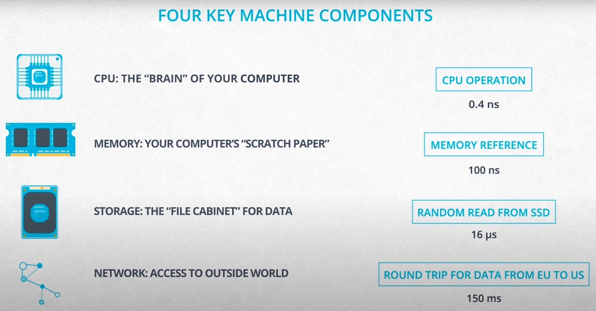

# Spark

I made these notes while following the Udacity course [Spark](https://www.udacity.com/course/learn-spark-at-udacity--ud2002).

Additionally, I extended the  notes with contents from the following courses at the Datacamp track [Big Data with PySpark](https://app.datacamp.com/learn/skill-tracks/big-data-with-pyspark):

- Introduction to PySpark
- Big Data Fundamentals with PySpark
- Cleaning Data with PySpark
- Feature Engineering with PySpark
- Machine Learning with PySpark
- Building Recommendation Engines with PySpark

Mikel Sagardia, 2023.  
No guarantees.

Table of contents:

- [Spark](#spark)
  - [1. Introduction](#1-introduction)
    - [Udacity Project Overview](#udacity-project-overview)
    - [Installation and Setup](#installation-and-setup)
  - [2. The Power of Spark](#2-the-power-of-spark)
    - [Big Data in Numbers](#big-data-in-numbers)
  - [3. Data Wrangling with Spark](#3-data-wrangling-with-spark)
  - [4. Setting up Spark Clusters with AWS](#4-setting-up-spark-clusters-with-aws)
  - [5. Debugging and Optimization](#5-debugging-and-optimization)
  - [6. Machine Learning with PySpark](#6-machine-learning-with-pyspark)

## 1. Introduction

This module is an introductory module of Udacity, where the basic course structure is explained, as well as a project.

Section videos:

- [Welcome](https://www.youtube.com/watch?v=D7vrej8uLzs&t=28s)
- [Instructors](https://www.youtube.com/watch?v=1h6ToHj7mcM)
- [Course Overview](https://www.youtube.com/watch?v=P7YAisWITAs)
- [Project Overview](https://www.youtube.com/watch?v=lPCzCEG2yRs)

### Udacity Project Overview

Video: [Project Overview](https://www.youtube.com/watch?v=lPCzCEG2yRs)

I made a dedicated repository for the Udacity final project: [sparkify_customer_churn](https://github.com/mxagar/sparkify_customer_churn). I have non-committed link to that repository in the folder [`lab`](./lab/); additionally, all coding examples from this module are collected in that folder [`lab`](./lab/).

Key ideas of the project:

- Music streaming service, similar to Spotify: Users can listen to streamed music.
- We have: (1) free-tier, (2) subscription plan.
- Every time an user is involved in an event, it is logged with a timestamp; example events: songplay, logout, like, ad_heard, downgrade, etc.
- Goal: predict churn, either (1) as downgrade from premium to free or (2) as leaving the service.
- With churn predictions, the company can target those users with incentives: discounts, etc.

### Installation and Setup

:construction:

## 2. The Power of Spark

Module videos:

- [Introduction to Spark](https://www.youtube.com/watch?v=RWtS_ErlmXE)
- [What Qualifies As Big Data](https://www.youtube.com/watch?v=tGHCCvKKpuo)
- [Numbers Everyone Should Know](https://www.youtube.com/watch?v=XGQT-uzt4v8)
- [Numbers Everyone Should Know: CPU](https://www.youtube.com/watch?v=LNv-urROvr0)

### Big Data in Numbers

Characteristics of Big Data:

- Data stored in several machines, distributed.
- High volume of data.
- High speed of data, velocity.
- High variety of data.

The numbers everyone should know (Peter Norveig, Google): We should learn at least the following hardware-related speed numbers and concepts:

- CPU operation: 0.4 ns
  - Mutex lock/unlock: 17 ns
  - Registers store small pieces of data that the CPU is crunching at the moment.
- Memory (RAM) reference: 100 ns
  - Read 1 MB sequentially in memory: 3 microsec.
- Storage: Random read from SSD: 16 microsec.
  - Read 1 MB sequentially in memory: 49 microsec.
- Network: Round trip data from EU to US: 150 millisec.
  - Send 2 KB in local commodity network: 44 ns

Links:

- [Peter Norveig: Teach Yourself Programming in Ten Years](http://norvig.com/21-days.html)
- [Interactive: Latency Numbers Every Programmer Should Know](https://colin-scott.github.io/personal_website/research/interactive_latency.html)

## 3. Data Wrangling with Spark

## 4. Setting up Spark Clusters with AWS

## 5. Debugging and Optimization

## 6. Machine Learning with PySpark